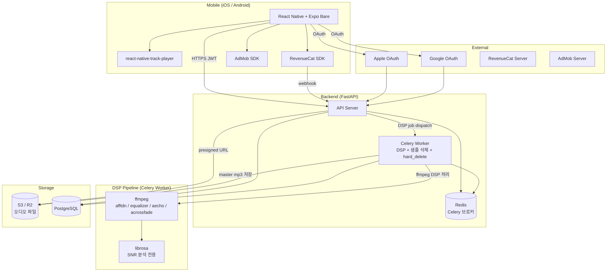
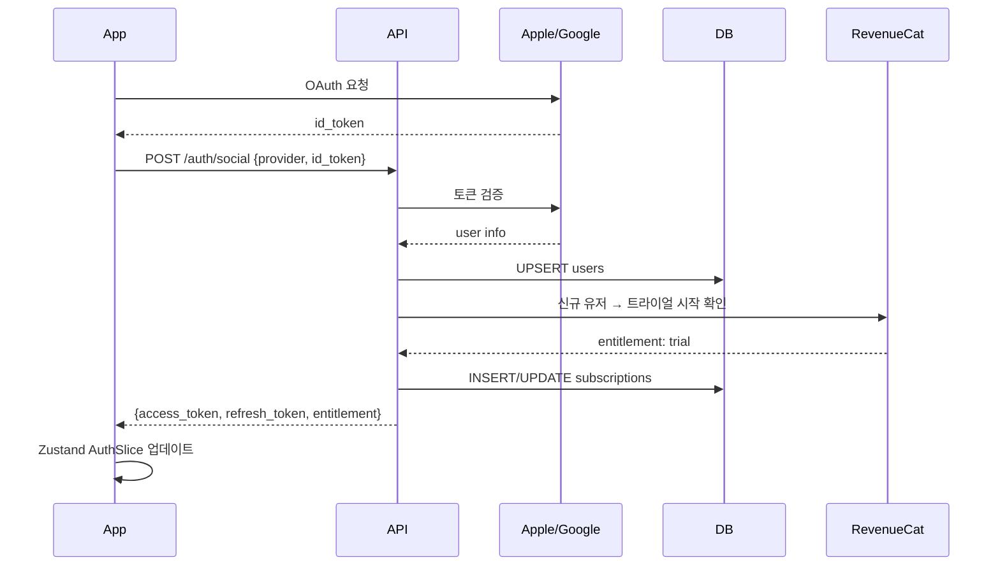
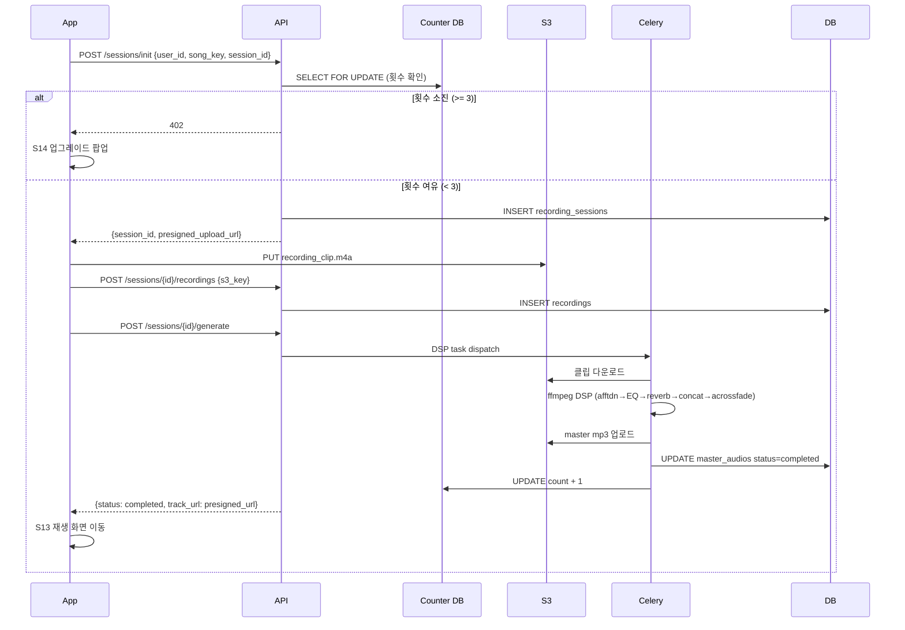
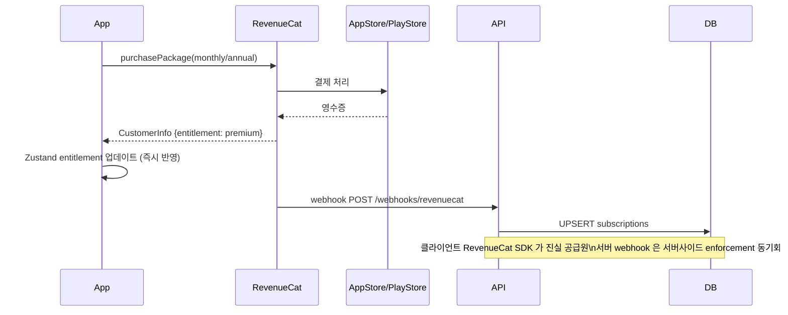

# Architecture — 자장(Jajang)

**버전**: v1.3.1
**작성일**: 2026-04-24 / 최종 갱신: 2026-04-30

> v1.3.1 (2026-04-30): PRD v1.3.1 반영 — GPU 인프라 전면 제거, DSP Celery 워커 추가, S08 화면 폐기, ERD 재정의 (recording_sessions / recordings / master_audios), crossfade 구현 확정 (서버 사전 concat 방식). v1.8 (2026-05-09) Epic 12 — 화면 컴포넌트 스타일 패턴 (createStyles factory / inline style), ColorTokens 15종.

> 본 문서는 시스템 전반의 결정·구조·기술 스택을 다룬다. 결정 사항만 빠르게 보려면 [`docs/ADR.md`](ADR.md) 참조. PRD 는 [`docs/PRD.md`](PRD.md).

---

## 디렉토리 구조

```
jajang/
├── apps/
│   ├── mobile/                    # React Native + Expo Bare
│   │   ├── src/
│   │   │   ├── screens/           # S01~S17 (S08 폐기)
│   │   │   ├── components/        # C06 미니플레이어, 공용 UI
│   │   │   ├── store/             # Zustand slices (auth, player, subscription, generation)
│   │   │   ├── services/          # API 클라이언트, RevenueCat, AdMob 래퍼
│   │   │   ├── audio/             # AudioEngine (RNTP 래퍼, loop, timer)
│   │   │   ├── theme/             # 디자인 토큰 (tokens.ts, typography.ts, spacing.ts, index.ts)
│   │   │   ├── hooks/             # useFonts.ts
│   │   │   └── utils/             # 클라이언트 품질 검증 (RMS, 피크)
│   │   ├── ios/                   # Info.plist (UIBackgroundModes: audio)
│   │   └── android/               # AndroidManifest (FOREGROUND_SERVICE)
│   │
│   └── api/                       # FastAPI 백엔드
│       ├── api/v1/                # auth, sessions, recordings, masters, rewarded, webhooks
│       ├── models/                # SQLAlchemy ORM (User, RecordingSession, Recording, MasterAudio, GenerationCounter, RewardedAdUsage, AuditLog)
│       ├── schemas/               # Pydantic v2 request/response
│       ├── services/              # DspService, StorageService, CounterService, SubscriptionService, RewardedService, AccountDeletionService
│       │   └── dsp/               # ffmpeg subprocess 래퍼 (노이즈 제거 / EQ / reverb / concat / acrossfade)
│       ├── tasks/                 # Celery tasks (dsp_processing, clip_cleanup, hard_delete_users)
│       └── core/                  # config, security, db session (async + sync)
│
├── docs/                          # 설계 문서 (PRD / ARCHITECTURE / ADR / db-schema / sdk / ui-spec / ux-flow / design / domain-logic)
└── backlog.md
```

**v1.7 변경점** (AI 합성 → DSP 전환에 따른 구조 재정의):
- `services/inference/` (VoiceInferenceClient ABC + MockClient + factory) → `services/dsp/` (ffmpeg 래퍼) 교체
- ORM 모델: `VoiceSample` + `GeneratedTrack` → `RecordingSession` + `Recording` + `MasterAudio`
- API 라우터: `generations` → `sessions` / `recordings` / `masters`

---

## 패턴

### 모바일 (React Native)
- **Bare workflow** — 백그라운드 재생 / AdMob 네이티브 모듈 필요 → Managed 한계 회피
- **단방향 상태 흐름** — Zustand slice 별 isolation, 컴포넌트는 selector 로만 구독
- **AudioEngine 추상화** — RNTP 직접 호출 X, AudioEngine 래퍼 단일 진입점 (loop / timer / fade-out 통합)
- **화면 스타일 패턴** (Epic 12) — `StyleSheet.create` 는 정적이라 `useTheme()` 내부 직접 사용 불가. 따라서:
  - `makeStyles(colors: ColorTokens)` factory — 스타일 4개+ 또는 재사용 컴포넌트
  - inline style — 스타일 3개 이하 단순 뷰
  - `Colors = darkColors` 별칭 (하위 호환) — tokens.ts 유지하되 신규 코드는 `useTheme().colors` 사용

### 백엔드 (FastAPI)
- **API 라우터 + Service 분리** — 라우터 = 입출력 / 인증 / 검증, Service = 비즈니스 로직
- **Async SQLAlchemy 2.x** — FastAPI 비동기 스택과 통일
- **Celery 워커 단독 DSP 처리** — API 서버 블록킹 회피. 30초 NFR 은 Celery 즉시 처리 (큐 대기 미고려)
- **SELECT FOR UPDATE 카운터** — 생성 횟수는 DB 레벨 lock 으로 동시성 보장

---

## 데이터 흐름

### 시스템 전체 구조



**v1.3.1 변경점:**
- GPU Inference (Replicate / Modal / RunPod) 블록 전면 삭제
- DSP Pipeline 블록 신설 — ffmpeg (DSP) + librosa (분석 전용)
- Celery Worker 역할: GPU 추론 → DSP 후처리로 교체

### 인증 시퀀스



### 음원 생성 시퀀스 (DSP 방식)



### 생성 횟수 카운터 상태머신

```
[무료 유저 생성 시도]
    │
    ▼
CHECK counter (SELECT FOR UPDATE) — POST /sessions/init
    │
    ├─ count >= 3 → 즉시 거부 (402) → 클라이언트 S14 팝업
    │
    └─ count < 3 → 세션 생성 허용
                        │
                        ▼
                  DSP 처리 (Celery)
                        │
                        ├─ 성공 → counter + 1 (commit)
                        │
                        └─ 실패 → counter 변경 없음
                                  재시도 = 동일 session_id → 차감 없음
```

**클립 추가 정책**: "다시 녹음" 후 "사용하기" → 동일 session 에 recording 추가. 세션 상태 = open → generating. 카운터 미차감.

### 계정 탈퇴 삭제 흐름 (계단형 + 30일 hard delete)

```
DELETE /users/me 수신
    │
    ▼
구독 활성 체크 → is_active=True 이면 422 반환
    │
    ▼
BEGIN TRANSACTION
  S3 녹음 클립 삭제 → S3 master mp3 삭제 (실패 시 로그만)
  users.deleted_at = NOW()  (CASCADE: 연관 테이블 DB 레코드 삭제)
  audit_log(account_deletion_requested) 기록
COMMIT
→ 202 반환

[30일 후] Celery Beat hard_delete_expired_users (매일 03:00 KST)
  → users 행 완전 제거 + audit_log(account_hard_deleted)
  → audit_logs 는 FK 없으므로 유지
```

### crossfade 구현 — 서버 사전 concat 방식

```
[POST /sessions/{id}/generate 수신]
    │
    ▼
Celery DSP task:
    1. recordings 조회 (session 내 validated 클립)
    2. S3 다운로드 → /tmp/
    3. 각 클립 개별 DSP (afftdn → equalizer → aecho)
    4. 셔플 (N=1: [A,A], N≥2: 직전 제외 Fisher-Yates)
    5. ffmpeg acrossfade concat → master.mp3
    6. S3 업로드 (masters/{session_id}.mp3)
    7. /tmp/ 정리

[클라이언트 재생]
    └─ 단일 master.mp3 를 RepeatMode.Queue loop
       crossfade 이미 구워진 상태 → 클라이언트 추가 처리 없음
```

**acrossfade 구현 메모**: `ffmpeg -i A -i B -filter_complex "[0][1]acrossfade=d=0.3:c1=tri:c2=tri" output.mp3`. N=1 케이스: `-i A -i A`. N≥2: filter_complex 체인.

### crossfade 대안 검토

| 대안 | 방법 | 장점 | 단점 |
|---|---|---|---|
| (a) 클라이언트 두 트랙 병렬 재생 | RNTP 두 인스턴스 또는 expo-av 병행 | 서버 부담 없음 | RNTP v4 두 인스턴스 공식 미지원, JS 타이머 정밀도 의존, N=1/N≥2 통합 경로 별도 필요 |
| (b) 서버 사전 concat + acrossfade | ffmpeg `acrossfade` 필터로 클립 경계 crossfade 처리 후 단일 mp3 출력 | N=1/N≥2 통합 경로, 클라이언트 단순 loop, crossfade 품질 서버 보장 | 클립 추가 시 재처리 필요 (캐시로 완화) |
| (c) 단순 반복 | RNTP RepeatMode.Track | 구현 0일 | PRD F6 "crossfade 300ms 이상" 위반 |

**채택**: (b) 서버 사전 concat + acrossfade. `acrossfade` 필터는 두 스트림 입력 요구 — N=1 케이스는 동일 클립 두 번 `-i A -i A` 입력. N≥2 셔플 concat 도 동일 파이프라인 — 단일 코드 경로. 클라이언트는 `RepeatMode.Queue` loop 만.

### 백그라운드 재생 entitlement 체크

```
[화면 잠금 / 홈 버튼 이벤트]
    │
    ▼
AppState 'background' 감지
    │
    ├─ entitlement = premium/trial
    │       → RNTP 계속 재생
    │
    ├─ entitlement = free, rewardedUnlockExpiresAt > Date.now()
    │       → RNTP 계속 재생 (자정까지)
    │
    └─ entitlement = free, 언락 없음
            → RNTP pause()
            → S14 팝업 (foreground 복귀 시)
```

### 구독/결제 시퀀스



### 화면 플로우 요약

상세 → [`docs/ux-flow.md`](ux-flow.md)

```
[앱 실행]
S01 스플래시
  ├─ 첫 실행 → S02 개인정보 동의 → S03 온보딩 → S04 가입
  ├─ 세션 유효 → S06 홈
  └─ 세션 만료 → S05 로그인

[음원 생성] ← S08 폐기 (v1.3.0)
S06 → S07(자장가 선택) → S09(녹음 가이드) → S10(녹음) → S11(미리듣기) → S12(생성 대기) → S13(재생)

[구독 전환]
S14(업그레이드 팝업) → S15(결제) → S06

[트라이얼 만료]
S06 → S17 → S15 또는 S06(무료)
```

> S08 (녹음 모드 선택) 화면 폐기 — 쉬/허밍 모드 분기 제거로 불필요. S09 가 단일 "1 loop 자유 녹음" 가이드 역할 수행.

---

## 상태 관리

### 모바일 — Zustand slices

```typescript
interface AuthSlice {
  userId: string | null
  accessToken: string | null
  entitlement: 'free' | 'trial' | 'premium'
  trialExpiresAt: string | null
  clearAuthState: () => void
}

interface PlayerSlice {
  currentSessionId: string | null   // recording_sessions.id (구: currentTrackId)
  isPlaying: boolean
  timerEndsAt: number | null
  rewardedUnlockExpiresAt: number | null
}

interface SubscriptionSlice {
  generationCount: number
  rewardedAdUsedThisMonth: number
  rewardedAdMonthKey: string       // 'YYYY-MM'
  rewardedUnlockExpiresAt: number | null
}
```

**v1.7 변경점**: `PlayerSlice.currentTrackId` → `currentSessionId` (recording_sessions.id 참조).

### 서버 — DB 상태 (PostgreSQL)

ERD:

```mermaid
erDiagram
    users ||--o{ recording_sessions : "has"
    users ||--|| generation_counters : "has"
    users ||--o{ rewarded_ad_usage : "has"
    users ||--o| subscriptions : "has"

    recording_sessions ||--o{ recordings : "has N clips"
    recording_sessions ||--o| master_audios : "has 1 output"

    users {
        uuid id PK
        text email UK
        text password_hash
        text provider "email | apple | google"
        text provider_uid
        boolean privacy_consent_given
        timestamptz privacy_consent_at
        timestamptz created_at
        timestamptz updated_at
        timestamptz deleted_at
    }

    recording_sessions {
        uuid id PK
        uuid user_id FK
        text session_id UK "클라이언트 생성 UUID (멱등성)"
        text song_key "brahms | mozart | schubert | twinkle | rockabye | hush"
        text status "open | generating | completed | failed"
        timestamptz created_at
        timestamptz updated_at
    }

    recordings {
        uuid id PK
        uuid session_id FK
        text s3_key "S3 클립 경로"
        float duration_seconds
        float rms_db
        int peak_count
        float snr_db
        text status "uploaded | validated | deleted"
        timestamptz schedule_delete_at "생성 완료 후 24h"
        timestamptz deleted_at
        timestamptz created_at
    }

    master_audios {
        uuid id PK
        uuid session_id FK UK
        text s3_key "결과 mp3 경로"
        text status "pending | processing | completed | failed"
        text error_message
        int dsp_duration_ms
        int clip_count "concat 시 클립 수"
        timestamptz created_at
        timestamptz completed_at
    }

    generation_counters {
        uuid user_id PK FK
        int count
        timestamptz last_generated_at
        timestamptz updated_at
    }

    rewarded_ad_usage {
        uuid id PK
        uuid user_id FK
        int year_month
        int monthly_count
        timestamptz today_unlock_expires_at
        timestamptz created_at
        timestamptz updated_at
    }

    subscriptions {
        uuid id PK
        uuid user_id FK UK
        text revenuecat_customer_id UK
        text entitlement "free | trial | premium"
        text product_id
        timestamptz trial_starts_at
        timestamptz trial_expires_at
        timestamptz current_period_ends_at
        boolean is_active
        timestamptz created_at
        timestamptz updated_at
    }

    audit_logs {
        uuid id PK
        text user_id
        text action
        jsonb metadata
        timestamptz created_at
    }
```

주요 테이블 요약:
- `users` — 계정 정보, 이메일/소셜 provider
- `recording_sessions` — 세션 단위 (멱등성 키, song_key, status). 카운터 차감 단위.
- `recordings` — 녹음 클립 (N개, 24h 삭제 대상)
- `master_audios` — DSP 결과 mp3 (session 당 1개)
- `generation_counters` — 무료 유저 누적 생성 횟수 (SELECT FOR UPDATE)
- `rewarded_ad_usage` — 월별 Rewarded Ad 시청 횟수 + 당일 언락 만료
- `subscriptions` — RevenueCat webhook 미러
- `audit_logs` — 계정 탈퇴 감사 로그 (FK 없음)

**마이그레이션 현황**:
- 0001~0005: 기존 (users, voice_samples[폐기], generated_tracks[폐기], rewarded_ad_usage, audit_logs)
- 0006: recording_sessions + recordings + master_audios 신설 + 구 테이블 폐기 (신규 작성 필요)

상세 DDL → [`docs/db-schema.md`](db-schema.md)

### 카운터 설계 결정 (별도 테이블)

`users` 테이블 컬럼 대안 기각 이유:
- `users` 행 lock 없이 카운터만 SELECT FOR UPDATE 가능 → 인증 쿼리와 lock contention 분리
- 무료→Premium 전환 시 카운터 리셋 로직 격리

Enforcement 시점: **DSP 생성 요청 전 체크** (업로드 전)

```
클라이언트 → POST /sessions/init (녹음 세션 생성 + 업로드 URL 요청)
    └─ 서버: SELECT FOR UPDATE generation_counters WHERE user_id = ?
        ├─ count >= 3 → HTTP 402 즉시 반환
        └─ count < 3 → recording_session 생성 + presigned URL 발급

DSP 처리 성공 시 (master_audio 완료):
    UPDATE generation_counters SET count = count + 1

DSP 실패 / 타임아웃 시:
    카운터 증가 없음 (재시도 = 동일 session_id, 차감 없음)
```

클립 추가 녹음 ("다시 녹음" + "사용하기") 은 동일 session 에 recording 행 추가 — 카운터 미차감.

---

## 외부 의존성

### 기술 스택

#### 프론트엔드
| 항목 | 기술 | 버전 기준 | 선택 이유 |
|---|---|---|---|
| 크로스플랫폼 프레임워크 | React Native + Expo Dev Client | SDK 52+ (Bare workflow) | 1인 개발 생산성 + 네이티브 모듈 접근 필수 (RNTP, AdMob) |
| 백그라운드 재생 | react-native-track-player | v4.x | iOS AV Session + Android ExoPlayer 공식 추상화 |
| 구독/IAP | RevenueCat React Native SDK | v7.x | 크로스플랫폼 entitlement 관리 |
| 광고 | react-native-google-mobile-ads | v13.x | AdMob 공식 RN 래퍼, 배너 + Rewarded |
| 상태 관리 | Zustand | v4.x | 경량 + persist 미들웨어 |
| 네비게이션 | React Navigation v7 | — | Stack + BottomSheet 조합 |
| 오디오 녹음 | expo-av / expo-audio | SDK 52 | 마이크 접근, RNTP 와 충돌 없음 |
| 폰트 로딩 | expo-font + @expo-google-fonts | — | DM Sans / DM Mono / Noto Sans KR 번들 로딩 |

#### 백엔드
| 항목 | 기술 | 선택 이유 |
|---|---|---|
| API 서버 | Python FastAPI | 비동기 처리, type hint |
| 태스크 큐 | Celery + Redis | DSP 처리 비동기 분리 + 24h 샘플 삭제 스케줄러 |
| DSP 처리 | ffmpeg (subprocess) | afftdn / equalizer / aecho / acrossfade — CPU 만 필요, GPU 불필요 |
| 음성 분석 | librosa | SNR 측정 + 음량/클리핑 검출 전용 (DSP 처리는 ffmpeg 담당) |
| DB ORM | SQLAlchemy 2.x (async) | FastAPI 비동기 스택 통일 |
| DB 마이그레이션 | Alembic | SQLAlchemy 표준 |
| 인증 | JWT (RS256) + bcrypt | Apple/Google OAuth → 서버 토큰 발행 |
| 파일 저장 | AWS S3 또는 Cloudflare R2 | M0 비용 비교 후 확정, API 호환 |

#### 인프라
| 항목 | 후보 | 확정 기준 |
|---|---|---|
| DB 호스팅 | Supabase PostgreSQL 또는 RDS | 1인 운영 관리 부담 최소 |
| Redis | Upstash Redis 또는 ElastiCache | Celery 브로커 |
| 오디오 저장 | AWS S3 또는 Cloudflare R2 | M0 비용 시뮬레이션 후 확정 |

> GPU 인프라 (Replicate / Modal / RunPod) 전면 제거. ffmpeg CPU 워커 1대로 MVP 시작 — 수요 증가 시 워커 수평 확장.

### SDK 연동

상세 → [`docs/sdk.md`](sdk.md)

| SDK | 목적 | 주의사항 |
|---|---|---|
| RevenueCat | 구독 entitlement | 신규 가입 즉시 트라이얼 활성화, webhook 으로 서버 동기화 |
| AdMob | 배너 + Rewarded | COPPA: tag_for_child_directed_treatment=false |
| react-native-track-player | 백그라운드 재생 | 단일 master mp3 RepeatMode.Queue loop (crossfade 서버 처리) |
| ffmpeg | DSP 처리 | afftdn / equalizer / aecho / acrossfade — CPU 만, GPU 불필요 |
| librosa | 음성 분석 | SNR 측정 + 음량/클리핑 검출 전용. DSP 처리는 ffmpeg 담당. |

### 환경변수

```bash
# 공통
DATABASE_URL=postgresql+asyncpg://...
REDIS_URL=redis://...
JWT_PRIVATE_KEY=...    # RS256
JWT_PUBLIC_KEY=...

# 스토리지
S3_BUCKET_NAME=jajang-audio
S3_REGION=ap-northeast-2
S3_ACCESS_KEY=...
S3_SECRET_KEY=...
CLOUDFLARE_R2_ENDPOINT=...   # R2 선택 시

# 소셜 인증
GOOGLE_CLIENT_ID=...    # Google OAuth 클라이언트 ID (aud 검증용)

# 모바일 (앱 빌드 시)
REVENUECAT_IOS_API_KEY=...
REVENUECAT_ANDROID_API_KEY=...
ADMOB_IOS_APP_ID=...
ADMOB_ANDROID_APP_ID=...
ADMOB_BANNER_UNIT_ID=...
ADMOB_REWARDED_UNIT_ID=...

# 개발 환경
ENV=development           # development | staging | production
MOCK_DSP=true             # 개발환경 DSP 처리 mock 분기 (ffmpeg 미설치 환경)
MOCK_LATENCY_MS=3000      # MockDspService 대기 시간
```

**v1.7 삭제된 환경변수** (GPU 인프라 제거):
- `REPLICATE_API_TOKEN` / `MODAL_TOKEN_ID` / `RUNPOD_API_KEY`
- `MOCK_GPU` → `MOCK_DSP` 로 대체
- `INFERENCE_PROVIDER` → 불필요 (ffmpeg 단독)
- `MOCK_FAIL_RATE` → 유지 (DSP 실패율 테스트에도 유용)

---

## 화면 컴포넌트

16 screens + 1 component — 상세 스펙 → [`docs/ux-flow.md`](ux-flow.md)

> S08 (녹음 모드 선택) 폐기 (PRD v1.3.0). 총 17 → 16 screens.

**디자인 토큰 시스템** (`src/theme/`) — impl-02 에서 파일·값 확정:
- `tokens.ts` — Colors(15종 — bgPrimary / bgDeep / surface / surfaceHigh / accentPrimary / accentSecondary / textPrimary / textSecondary / border / destructive / success / overlay + 파생 투명도 3종), FontFamily(6종), FontSize(7단계), Radius(4단계), pure constants
- `typography.ts` — Typography 프리셋 8종
- `spacing.ts` — Spacing 6단계 (xs=4 ~ xxl=48)
- `index.ts` — 배럴 export
- `useFonts.ts` — expo-font 폰트 로딩 훅

핵심 컴포넌트:
- `AudioEngine` — RNTP 래퍼, 단일 mp3 loop, timer fade-out
- `WaveformVisualizer` — 실시간(녹음 중) + 정적(미리듣기) 두 모드
- `MiniPlayer` (C06) — S06 하단 고정, Premium/Trial 전용
- `UpgradeSheet` (S14) — 두 variant: background-unlock / generation-exhausted
- `SubscribeScreen` (S15) — 월/연 플랜 선택 + RevenueCat purchasePackage + 복원
- `SettingsScreen` (S16) — 구독 관리 딥링크 + 플랜 업그레이드 + 데이터 삭제 + 로그아웃
- `TrialExpiredScreen` (S17) — 트라이얼 만료 안내 + 구독 CTA + 무료 전환
- `AccountDeletionScreen` — 탈퇴 2단계 확인
- `LegalScreen` — 개인정보처리방침 / 이용약관
- `DeleteTracksSheet` — 음원 개별/전체 삭제 바텀 시트

---

## NFR 달성 전략

| NFR | 목표 | 전략 |
|---|---|---|
| DSP 응답시간 | 30초 이내 | M0 self-test — ffmpeg subprocess 동기 처리. 초과 시 NFR 완화(60초) 재협의 |
| 재생 loop gap | 체감 무음 없음 (crossfade 300ms 이상) | 서버 acrossfade 사전 처리 (d=0.3, c1=c2=tri). 클라이언트는 단순 loop |
| 목소리 클립 보관 | master_audio 완료 후 24h 이내 삭제 | Celery Beat 주기 1h + S3 lifecycle 백업 |
| 보안 | presigned URL, HTTPS | S3 private, 만료 1h presigned URL |
| 오프라인 재생 | Premium 유저 | 로컬 파일시스템 저장 (expo-file-system) + RNTP 로컬 경로 |
| 접근성 | VoiceOver/TalkBack 핵심 CTA | accessibilityLabel 모든 CTA 에 필수 |

---

## 보안 설계

| 영역 | 결정 | 근거 |
|---|---|---|
| 전송 | HTTPS 전용 (HTTP 301 리다이렉트) | 생체정보(음성) 전송 경로 암호화 필수 |
| 인증 토큰 | RS256 JWT, access 1h / refresh 30d rotation | 비대칭키로 API 서버 외부 검증 가능 |
| 오디오 파일 접근 | S3 presigned URL, 만료 1시간 | 앱 내에서만 재생, URL 유출 시 피해 최소화 |
| 목소리 클립 | S3 `/recordings/` prefix, private ACL | 생성 완료 후 24h Celery 삭제 + S3 lifecycle 백업 |
| 생성 횟수 | SELECT FOR UPDATE (DB 레벨) | 클라이언트 우회 원천 차단 |
| AdMob COPPA | tag_for_child_directed_treatment=false | 부모용 앱 포지셔닝 — 아동 대상 광고 법적 제외 |
| 시크릿 | 환경변수 (secret store), 코드에 하드코딩 금지 | CLAUDE.md 원칙 준수 |

---

## 관찰가능성 설계

| 항목 | 도구 | 수집 대상 |
|---|---|---|
| 에러 추적 | Sentry (RN + FastAPI) | DSP 실패, 결제 오류, crossfade 이음새 이슈 |
| API 로깅 | FastAPI middleware (structlog) | 생성 횟수 체크, 402 응답, webhook 수신 |
| 성능 | Sentry Performance | end-to-end DSP latency (NFR 30초 검증) |
| 비즈니스 지표 | RevenueCat Dashboard | 전환율, Churn, MRR |
| 광고 | AdMob Dashboard | 배너 노출, Rewarded 완료율 |
| 클립 삭제 | Celery 로그 + DB `deleted_at` | 24h 삭제 SLA 모니터링 |
| DSP self-test | M0 단계 수동 청취 | 단조로움 / 이음새 / 노이즈 3항목 |

---

## 앱스토어 심사 주의사항

| 항목 | 조치 |
|---|---|
| 백그라운드 오디오 모드 | Info.plist `UIBackgroundModes: [audio]` |
| Android Foreground Service | `AndroidManifest.xml` FOREGROUND_SERVICE permission + notification channel |
| Apple IAP 강제 | 인앱 구독 전용 (웹 결제 유도 버튼 없음) |
| 의료기기 아님 고지 | 앱스토어 설명 + 온보딩에 "수면 보조 도구" 명시, 의료 효능 주장 금지 |
| 생체정보 수집 | App Privacy 섹션: 음성 데이터 수집 + 24h 삭제 명시 |
| "부모가 직접 부른" 마케팅 | AI 합성 주장 없음 — 앱 설명·스토어 카피 전부 DSP 후처리 맥락 |
