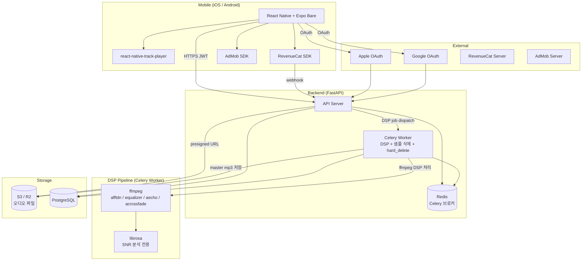
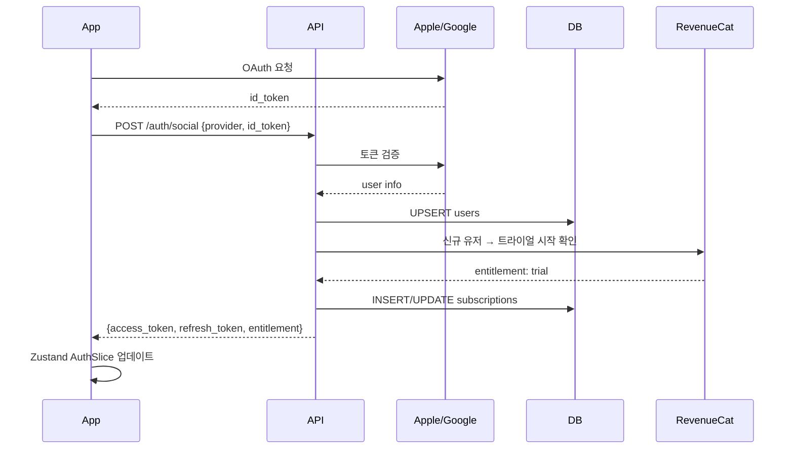
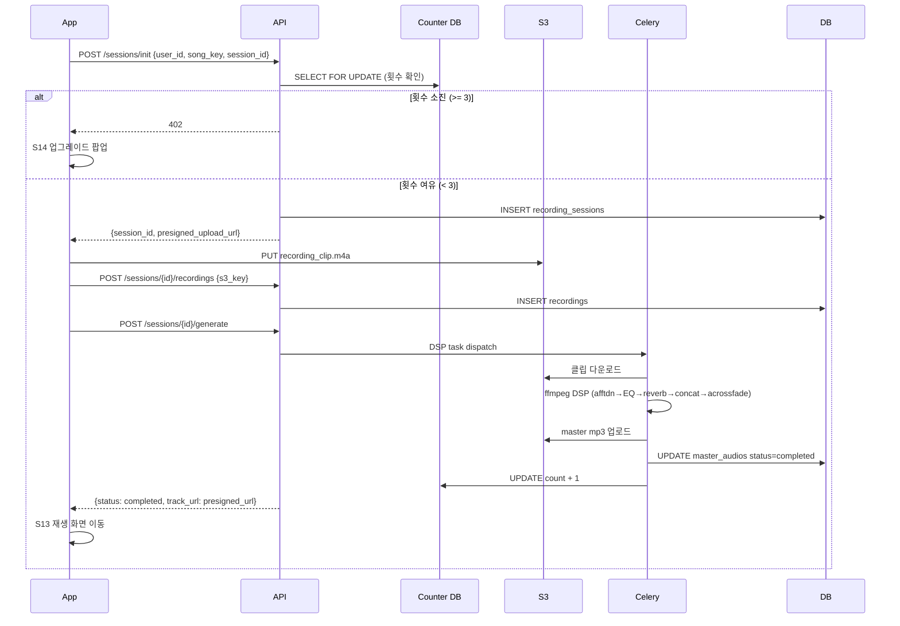
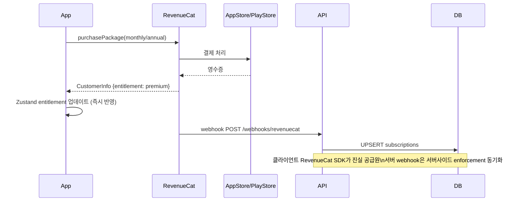

# Architecture — 자장(Jajang)

**버전**: v1.3.1
**작성일**: 2026-04-24 / 최종 갱신: 2026-04-30

> v1.3.1 (2026-04-30): PRD v1.3.1 반영 — GPU 인프라 전면 제거, DSP Celery 워커 추가, S08 화면 폐기, ERD 재정의 (recording_sessions / recordings / master_audios), crossfade 구현 확정 (서버 사전 concat 방식).

---

## 1. 시스템 전체 구조



**v1.3.1 변경점:**
- GPU Inference (Replicate / Modal / RunPod) 블록 전면 삭제
- DSP Pipeline 블록 신설 — ffmpeg (DSP) + librosa (분석 전용)
- Celery Worker 역할: GPU 추론 → DSP 후처리로 교체

---

## 2. 핵심 결정: crossfade 구현 방식

### 검토한 세 가지 대안

| 대안 | 방법 | 장점 | 단점 |
|---|---|---|---|
| (a) 클라이언트 두 트랙 병렬 재생 | RNTP 두 인스턴스 또는 expo-av 병행 | 서버 부담 없음 | RNTP v4 두 인스턴스 공식 미지원, JS 타이머 정밀도 의존, N=1/N≥2 통합 경로 별도 필요 |
| (b) 서버 사전 concat + acrossfade | ffmpeg `acrossfade` 필터로 클립 경계 crossfade 처리 후 단일 mp3 출력 | N=1/N≥2 통합 경로, 클라이언트 단순 loop, crossfade 품질 서버 보장 | 클립 추가 시 재처리 필요 (캐시로 완화) |
| (c) 단순 반복 | RNTP RepeatMode.Track | 구현 0일 | PRD F6 "crossfade 300ms 이상" 위반 |

### 채택: **(b) 서버 사전 concat + acrossfade**

**근거:**
1. `acrossfade` 필터는 두 스트림 입력을 요구한다. N=1 케이스는 동일 클립 두 번을 `-i A -i A` 형태로 입력하면 경계 crossfade 처리 가능.
2. N≥2 셔플 concat도 동일 ffmpeg 파이프라인으로 처리 — N=1/N≥2 단일 코드 경로.
3. 클라이언트는 단일 mp3를 `RepeatMode.Queue`(또는 `RepeatMode.Track`)로 loop만 — 복잡성 없음.
4. (a)의 클라이언트 crossfade는 RNTP 두 인스턴스 공식 미지원 + JS 타이머 오차 문제 여전히 존재.
5. (c)는 PRD F6 수용 기준 위반 — 아키텍트 단독 스펙 완화 불가.

**구현 상세:**

```
# N=1: 동일 클립 2회 concat + crossfade
ffmpeg -i clip_a.mp3 -i clip_a.mp3 \
  -filter_complex "[0][1]acrossfade=d=0.3:c1=tri:c2=tri" \
  -b:a 128k output.mp3

# N≥2: 셔플 순서 concat + 경계마다 crossfade
ffmpeg -i clip_a.mp3 -i clip_b.mp3 -i clip_c.mp3 \
  -filter_complex \
  "[0][1]acrossfade=d=0.3:c1=tri:c2=tri[ac01]; \
   [ac01][2]acrossfade=d=0.3:c1=tri:c2=tri" \
  -b:a 128k output.mp3
```

crossfade 파라미터: `d=0.3` (300ms) — PRD NFR 수용 기준. `c1=c2=tri` (삼각형 커브, 가장 자연스러운 페이드).

**클라이언트 재생:**
```typescript
// 단순 loop — 서버가 crossfade를 미리 구워서 전달
await TrackPlayer.add({ url: masterAudioUrl, id: 'master' });
await TrackPlayer.setRepeatMode(RepeatMode.Queue);
await TrackPlayer.play();
```

---

## 3. 핵심 결정: DSP 파이프라인 처리 위치

### 채택: Celery 워커 단독, ffmpeg subprocess

**근거:**
1. PRD 명시 "서버 ffmpeg 워커 단독 (CPU, GPU 불필요)".
2. 기존 Celery 인프라 (Redis 브로커) 재사용 — 신규 인프라 없음.
3. 30초 이내 NFR: 단순 DSP는 ffmpeg subprocess.run (동기)으로 충분. Celery 큐 대기 없이 워커가 즉시 처리.
4. 캐싱: `recording_session_id` + 클립 구성이 동일하면 `master_audios.s3_key` 반환 (재처리 없음).

**DSP 처리 순서 (Celery task):**
```
1. recordings 조회 (해당 session의 모든 클립 s3_key)
2. S3 다운로드 → 로컬 임시 디렉토리
3. librosa SNR 검증 (15dB 이상)
4. ffmpeg: afftdn (노이즈 제거) → equalizer (EQ) → aecho (reverb)
5. ffmpeg: acrossfade concat (N=1: 자기 자신 2회, N≥2: 셔플 순서)
6. 출력 mp3 S3 업로드 → master_audios 레코드 업데이트
7. 임시 파일 정리
```

---

## 4. 핵심 결정: 생성 횟수 카운터 설계

### DDL 선택: 별도 `generation_counters` 테이블 (유지)

`users` 테이블 컬럼 대안 기각 이유:
- `users` 행 lock 없이 카운터만 SELECT FOR UPDATE 가능 → 인증 쿼리와 lock contention 분리
- 무료→Premium 전환 시 카운터 리셋 로직 격리

### Enforcement 시점: **DSP 생성 요청 전 체크** (업로드 전)

```
클라이언트 → POST /sessions/init (녹음 세션 생성 + 업로드 URL 요청)
    └─ 서버: SELECT FOR UPDATE generation_counters WHERE user_id = ?
        ├─ count >= 3 → HTTP 402 즉시 반환
        └─ count < 3 → recording_session 생성 + presigned URL 발급

DSP 처리 성공 시 (master_audio 완료):
    UPDATE generation_counters SET count = count + 1

DSP 실패 / 타임아웃 시:
    카운터 증가 없음 (재시도 = 동일 session_id, 차감 없음)
```

클립 추가 녹음 ("다시 녹음" + "사용하기")는 동일 session에 recording 행 추가 — 카운터 미차감.

---

## 5. 인증 시퀀스



---

## 6. 음원 생성 시퀀스 (DSP 방식)



---

## 7. 구독/결제 시퀀스



---

## 8. 화면 플로우 (UX Flow 요약)

상세 → `docs/ux-flow.md`

```
[앱 실행]
S01 스플래시
  ├─ 첫 실행 → S02 개인정보 동의 → S03 온보딩 → S04 가입
  ├─ 세션 유효 → S06 홈
  └─ 세션 만료 → S05 로그인

[음원 생성] ← S08 폐기 (v1.3.0)
S06 → S07(자장가 선택) → S09(녹음 가이드) → S10(녹음) → S11(미리듣기) → S12(생성 대기) → S13(재생)

[구독 전환]
S14(업그레이드 팝업) → S15(결제) → S06

[트라이얼 만료]
S06 → S17 → S15 또는 S06(무료)
```

> S08 (녹음 모드 선택) 화면 폐기 — 쉬/허밍 모드 분기 제거로 불필요. S09가 단일 "1 loop 자유 녹음" 가이드 역할 수행.

---

## 9. ERD

```mermaid
erDiagram
    users ||--o{ recording_sessions : "has"
    users ||--|| generation_counters : "has"
    users ||--o{ rewarded_ad_usage : "has"
    users ||--o| subscriptions : "has"

    recording_sessions ||--o{ recordings : "has N clips"
    recording_sessions ||--o| master_audios : "has 1 output"

    users {
        uuid id PK
        text email UK
        text password_hash
        text provider "email | apple | google"
        text provider_uid
        boolean privacy_consent_given
        timestamptz privacy_consent_at
        timestamptz created_at
        timestamptz updated_at
        timestamptz deleted_at
    }

    recording_sessions {
        uuid id PK
        uuid user_id FK
        text session_id UK "클라이언트 생성 UUID (멱등성)"
        text song_key "brahms | mozart | schubert | twinkle | rockabye | hush"
        text status "open | generating | completed | failed"
        timestamptz created_at
        timestamptz updated_at
    }

    recordings {
        uuid id PK
        uuid session_id FK
        text s3_key "S3 클립 경로"
        float duration_seconds
        float rms_db
        int peak_count
        float snr_db
        text status "uploaded | validated | deleted"
        timestamptz schedule_delete_at "생성 완료 후 24h"
        timestamptz deleted_at
        timestamptz created_at
    }

    master_audios {
        uuid id PK
        uuid session_id FK UK
        text s3_key "결과 mp3 경로"
        text status "pending | processing | completed | failed"
        text error_message
        int dsp_duration_ms
        int clip_count "concat 시 클립 수"
        timestamptz created_at
        timestamptz completed_at
    }

    generation_counters {
        uuid user_id PK FK
        int count
        timestamptz last_generated_at
        timestamptz updated_at
    }

    rewarded_ad_usage {
        uuid id PK
        uuid user_id FK
        int year_month
        int monthly_count
        timestamptz today_unlock_expires_at
        timestamptz created_at
        timestamptz updated_at
    }

    subscriptions {
        uuid id PK
        uuid user_id FK UK
        text revenuecat_customer_id UK
        text entitlement "free | trial | premium"
        text product_id
        timestamptz trial_starts_at
        timestamptz trial_expires_at
        timestamptz current_period_ends_at
        boolean is_active
        timestamptz created_at
        timestamptz updated_at
    }

    audit_logs {
        uuid id PK
        text user_id
        text action
        jsonb metadata
        timestamptz created_at
    }
```

---

## 10. 보안 설계

| 영역 | 결정 | 근거 |
|---|---|---|
| 전송 | HTTPS 전용 (HTTP 301 리다이렉트) | 생체정보(음성) 전송 경로 암호화 필수 |
| 인증 토큰 | RS256 JWT, access 1h / refresh 30d rotation | 비대칭키로 API 서버 외부 검증 가능 |
| 오디오 파일 접근 | S3 presigned URL, 만료 1시간 | 앱 내에서만 재생, URL 유출 시 피해 최소화 |
| 목소리 클립 | S3 `/recordings/` prefix, private ACL | 생성 완료 후 24h Celery 삭제 + S3 lifecycle 백업 |
| 생성 횟수 | SELECT FOR UPDATE (DB 레벨) | 클라이언트 우회 원천 차단 |
| AdMob COPPA | tag_for_child_directed_treatment=false | 부모용 앱 포지셔닝 — 아동 대상 광고 법적 제외 |
| 시크릿 | 환경변수 (secret store), 코드에 하드코딩 금지 | CLAUDE.md 원칙 준수 |

---

## 11. 관찰가능성 설계

| 항목 | 도구 | 수집 대상 |
|---|---|---|
| 에러 추적 | Sentry (RN + FastAPI) | DSP 실패, 결제 오류, crossfade 이음새 이슈 |
| API 로깅 | FastAPI middleware (structlog) | 생성 횟수 체크, 402 응답, webhook 수신 |
| 성능 | Sentry Performance | end-to-end DSP latency (NFR 30초 검증) |
| 비즈니스 지표 | RevenueCat Dashboard | 전환율, Churn, MRR |
| 광고 | AdMob Dashboard | 배너 노출, Rewarded 완료율 |
| 클립 삭제 | Celery 로그 + DB `deleted_at` | 24h 삭제 SLA 모니터링 |
| DSP self-test | M0 단계 수동 청취 | 단조로움 / 이음새 / 노이즈 3항목 |

---

## 12. 앱스토어 심사 주의사항

| 항목 | 조치 |
|---|---|
| 백그라운드 오디오 모드 | Info.plist `UIBackgroundModes: [audio]` |
| Android Foreground Service | `AndroidManifest.xml` FOREGROUND_SERVICE permission + notification channel |
| Apple IAP 강제 | 인앱 구독 전용 (웹 결제 유도 버튼 없음) |
| 의료기기 아님 고지 | 앱스토어 설명 + 온보딩에 "수면 보조 도구" 명시, 의료 효능 주장 금지 |
| 생체정보 수집 | App Privacy 섹션: 음성 데이터 수집 + 24h 삭제 명시 |
| "부모가 직접 부른" 마케팅 | AI 합성 주장 없음 — 앱 설명·스토어 카피 전부 DSP 후처리 맥락 |
