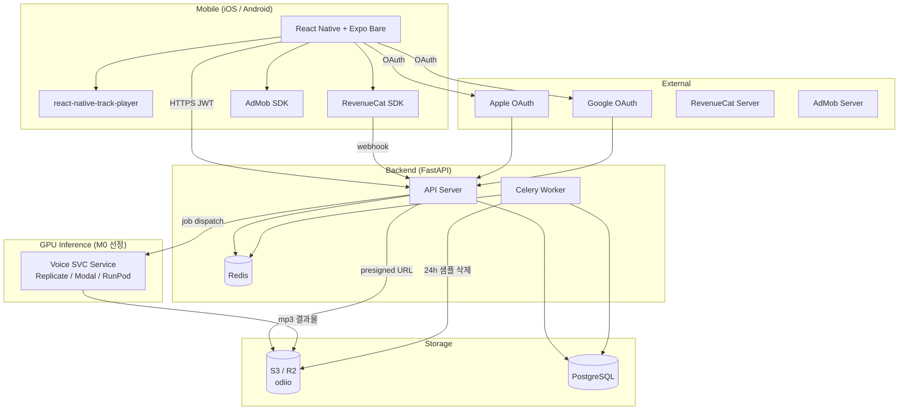
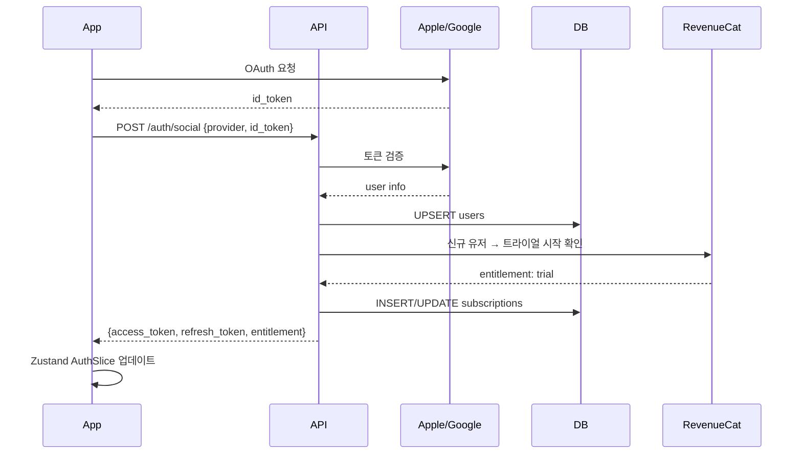
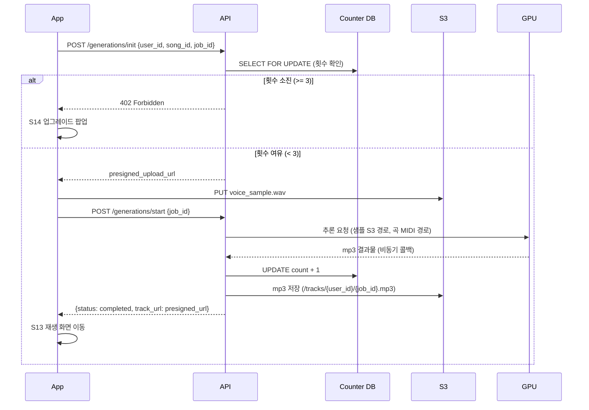
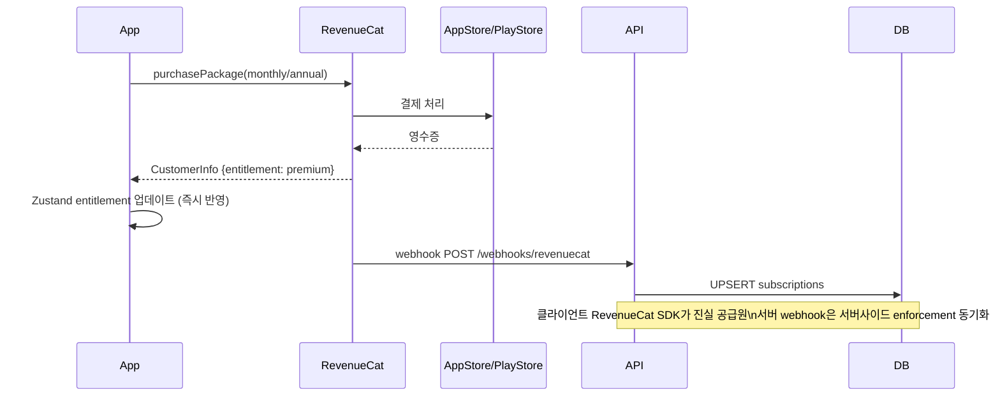

# Architecture — 자장(Jajang)

**버전**: v1.0  
**작성일**: 2026-04-24

---

## 1. 시스템 전체 구조



---

## 2. 핵심 결정: crossfade 구현 방식

### 검토한 세 가지 대안

| 대안 | 방법 | 장점 | 단점 |
|---|---|---|---|
| (a) 두 트랙 병렬 재생 + volume ramp | RNTP에 두 트랙을 큐에 올리고, 트랙 끝 직전 `TrackPlayer.setVolume()` + 두 번째 트랙 `seekTo(0)` 동시 실행 | RNTP 공개 API만 사용, 네이티브 코드 불필요, 1인 개발 유지보수 용이 | RNTP가 crossfade를 공식 지원하지 않아 JS 타이머 정밀도에 의존. 300ms 정밀도는 JS thread 블로킹 시 ±50ms 오차 가능 |
| (b) ExoPlayer / AVPlayer 직접 래핑 | 네이티브 모듈 신규 작성 (Kotlin + Swift). 플랫폼 MediaSession 직접 제어 | 정밀한 crossfade 보장, OS 레벨 오디오 세션 완전 제어 | 1인 개발에 Kotlin + Swift 네이티브 모듈 신규 작성 = 개발 기간 3~4주 추가, 유지보수 부담 2배, iOS/Android 동작 차이 별도 대응 필요 |
| (c) crossfade 포기 + 단순 반복 | RNTP repeat mode 활용, 트랙 끝 → 즉시 처음으로 점프 | 구현 0일 | PRD F6 수용 기준("crossfade 300ms 이상") 위반. 스펙 완화는 product-planner 에스컬레이션 필요 |

### 채택: **(a) 두 트랙 병렬 재생 + volume ramp**

**근거:**
1. 1인 개발 체계에서 (b)의 네이티브 모듈 신규 작성은 MVP 타임라인(10~14주) 내 불가.
2. (c)는 PRD 명시 수용 기준("체감 무음 없음, crossfade 300ms 이상") 위반 — 아키텍트 단독으로 스펙 완화 불가.
3. (a)의 JS 타이머 오차(±50ms)는 300ms crossfade 지속 시간 대비 수용 가능한 수준. 수면 상황에서 250~350ms 범위는 체감 차이 없음.
4. RNTP v4에서 `add()`, `skip()`, `setVolume()`은 네이티브 큐 기반으로 JS bridge 지연이 오디오 재생 자체에 영향 없음.

**구현 상세 → `docs/audio-engine.md` §3 참조**

---

## 3. 핵심 결정: 생성 횟수 카운터 설계

### DDL 선택: 별도 `generation_counters` 테이블

`users` 테이블에 컬럼으로 두는 대신 별도 테이블을 선택한 이유:
- `users` 행 lock 없이 카운터만 SELECT FOR UPDATE 가능 → 인증 쿼리와 lock contention 분리
- 향후 생성 이력(타임스탬프, 곡 ID) 추가 시 확장 용이
- 무료→Premium 전환 시 카운터 리셋 로직 격리

### Enforcement 시점: **업로드 전 체크**

```
클라이언트 → POST /generations/init (샘플 업로드 URL 요청)
    └─ 서버: SELECT FOR UPDATE generation_counters WHERE user_id = ?
        ├─ count >= 3 → HTTP 402 즉시 반환 (업로드 presigned URL 발급 안 함)
        └─ count < 3 → presigned URL 발급 → 클라이언트 업로드 → GPU 추론 시작

GPU 추론 성공 시:
    UPDATE generation_counters SET count = count + 1 WHERE user_id = ?

GPU 추론 실패 / 타임아웃 시:
    카운터 증가 없음 (재시도 = 동일 job_id, 차감 없음)
```

**업로드 전 체크를 선택한 이유:**
- 생성 실패 후 카운터 롤백 로직 불필요 → 단순성
- PRD 명시: "재시도는 횟수 차감 없음 — 최종 생성 성공 시에만 1회 차감"
- 업로드 자체도 서버 비용(S3 PUT + 네트워크)이므로 횟수 소진 시 업로드 허용 불필요

**Race condition 대응:**
- `SELECT FOR UPDATE` + 단일 트랜잭션으로 동시 업로드 중복 차감 차단
- DB 레벨 unique constraint: `generation_counters.user_id` UNIQUE
- 애플리케이션 레벨 재시도는 `job_id` (UUID, 클라이언트 생성) 기준 멱등성 보장

**실패 시 롤백 정책:**
- GPU 추론 실패 → 카운터 변경 없음 (아직 증가하지 않았으므로 롤백 필요 없음)
- 네트워크 단절 후 클라이언트 재시도 → 동일 `job_id` 전송 → 서버에서 기존 job 상태 조회 → 진행 중이면 대기, 성공이면 mp3 URL 반환

---

## 4. 인증 시퀀스



---

## 5. AI 음원 생성 시퀀스



---

## 6. 구독/결제 시퀀스



---

## 7. 화면 플로우 (UX Flow 요약)

상세 → `docs/ux-flow.md`

```
[앱 실행]
S01 스플래시
  ├─ 첫 실행 → S02 개인정보 동의 → S03 온보딩 → S04 가입
  ├─ 세션 유효 → S06 홈
  └─ 세션 만료 → S05 로그인

[음원 생성]
S06 → S07(자장가 선택) → S08(녹음 모드) → S09(가이드) → S10(녹음) → S11(미리듣기) → S12(생성 대기) → S13(재생)

[구독 전환]
S14(업그레이드 팝업) → S15(결제) → S06

[트라이얼 만료]
S06 → S17 → S15 또는 S06(무료)
```

---

## 8. 보안 설계

| 영역 | 결정 | 근거 |
|---|---|---|
| 전송 | HTTPS 전용 (HTTP 301 리다이렉트) | 생체정보(음성) 전송 경로 암호화 필수 |
| 인증 토큰 | RS256 JWT, access 1h / refresh 30d rotation | 비대칭키로 API 서버 외부 검증 가능 |
| 오디오 파일 접근 | S3 presigned URL, 만료 1시간 | 앱 내에서만 재생, URL 유출 시 피해 최소화 |
| 목소리 샘플 | S3 `/samples/` prefix, private ACL | 생성 완료 후 24h Celery 삭제 + S3 lifecycle 백업 |
| 생성 횟수 | SELECT FOR UPDATE (DB 레벨) | 클라이언트 우회 원천 차단 |
| AdMob COPPA | tag_for_child_directed_treatment=false | 부모용 앱 포지셔닝 — 아동 대상 광고 법적 제외 |
| 시크릿 | 환경변수 (secret store), 코드에 하드코딩 금지 | CLAUDE.md 원칙 준수 |

---

## 9. 관찰가능성 설계

| 항목 | 도구 | 수집 대상 |
|---|---|---|
| 에러 추적 | Sentry (RN + FastAPI) | 생성 실패, 결제 오류, crossfade 예외 |
| API 로깅 | FastAPI middleware (structlog) | 생성 횟수 체크, 402 응답, webhook 수신 |
| 성능 | Sentry Performance | end-to-end 생성 latency (M0 NFR 90초 검증) |
| 비즈니스 지표 | RevenueCat Dashboard | 전환율, Churn, MRR |
| 광고 | AdMob Dashboard | 배너 노출, Rewarded 완료율 |
| 샘플 삭제 | Celery 로그 + DB `deleted_at` | 24h 삭제 SLA 모니터링 |

---

## 10. 앱스토어 심사 주의사항

| 항목 | 조치 |
|---|---|
| 백그라운드 오디오 모드 | Info.plist `UIBackgroundModes: [audio]` |
| Android Foreground Service | `AndroidManifest.xml` FOREGROUND_SERVICE permission + notification channel |
| Apple IAP 강제 | 인앱 구독 전용 (웹 결제 유도 버튼 없음) |
| 의료기기 아님 고지 | 앱스토어 설명 + 온보딩에 "수면 보조 도구" 명시, 의료 효능 주장 금지 |
| 생체정보 수집 | App Privacy 섹션: 음성 데이터 수집 + 24h 삭제 명시 |
