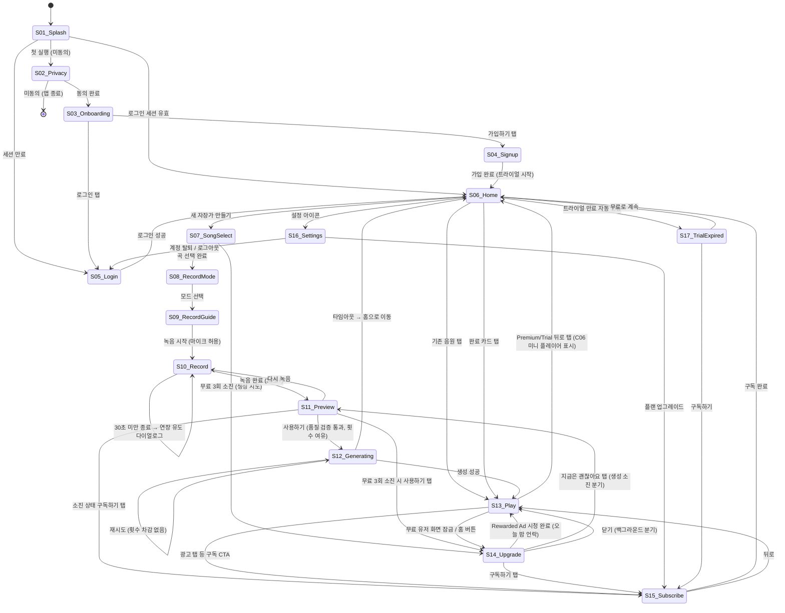

# UX Flow Document — 자장(Jajang)

## 메타
- 생성 모드: UX_FLOW
- PRD: prd.md (v1.1, 2026-04-24)
- 생성일: 2026-04-25
- 화면 수: 17 screens + 1 component (C06)

---

## 0. 디자인 가이드

> 자장(Jajang)은 야간에 주로 쓰이는 수면 보조 앱이다. 부모가 아기를 재우며 조용히 조작하는 맥락. 화면 빛이 어두운 방에서 켜지는 상황이므로 눈을 피로하게 하지 않아야 하고, 감정적으로 따뜻하되 UI는 조용해야 한다. Anti-AI-Smell 규칙 전면 적용 — 보라/파랑 그라디언트 + 흰 카드 그리드 조합 일절 배제.

### 컬러 방향
- **기조**: 다크 미드나이트 — 밤하늘처럼 깊고 조용한 배경, 강한 명도 대비 아닌 낮은 채도 다크
- **배경**: `#0D0F1A` ~ `#12152B` (깊은 남색 계열 — 순수 black 아님, 온기 있는 다크)
- **서피스**: `#1A1D30` ~ `#21253E` (카드/시트 배경)
- **엑센트 Primary**: `#82B090` (Sage Mist — 모스 세이지 그린, 수면·자연·평온 무드. AI 클리셰와 무관한 유기적 색조)
- **엑센트 Secondary**: `#8BAED4` (연한 달빛 블루 — 보조 정보, 아이콘 등)
- **경계선**: `#2A2E48` (subtle, 과하지 않은 구분선)
- **텍스트 주**: `#EEF0F8` / **텍스트 보조**: `#7B80A0`
- **금지**: `#F5C97A` / `#E8A94A` (Claude 오렌지/앰버 — 완전 제거), 인디고/바이올렛(`#6366f1`) 계열, 흰 배경 + 파란 버튼 조합, 무지개 그라디언트, 순수 black(`#000`) 배경

### 타이포 방향
- **제목·헤드라인**: 둥글고 부드러운 sans-serif — DM Sans / Nunito 계열 (시스템 기본 Inter 금지)
- **본문**: 가독성 높은 가벼운 weight, 자간 +0.2 (피로한 눈을 위한 여유)
- **한글**: Noto Sans KR Light~Regular — 명조 혼용 금지, 손글씨 금지, 굵은 고딕 금지
- **숫자·타이머**: Tabular numbers — 파형·타이머 숫자 흔들림 방지
- **금지**: `-apple-system` 단독 사용, 시스템 Bold 위주 위계

### 톤/보이스
- **버튼 라벨**: 동사형 구어체 — "들어볼게요", "시작할게요", "다시 녹음", "구독하기" (아닌 것: "제출", "확인", "시작하기")
- **빈 상태**: "아직 자장가가 없어요. 목소리를 담아볼까요?" (아닌 것: "데이터가 없습니다")
- **에러**: "조금 더 크게 녹음해주세요" / "조용한 곳에서 다시 해봐요" (아닌 것: "오류가 발생했습니다")
- **로딩**: "아기를 위한 목소리를 만들고 있어요 ·· N초쯤 걸려요"
- **금지**: "~해 보세요", "~를 경험하세요" 식 마케팅 문구, 무미건조한 시스템 메시지

### UI 패턴
- **카드**: 낮은 elevation, 테두리 없음 — 배경보다 약간 밝은 서피스로만 구분. 라운드 `r-16`
- **버튼 Primary**: 세이지 그린(`#82B090`) 채움 + 다크 텍스트, 높이 56dp, 라운드 `r-28` (pill 형태)
- **버튼 Secondary**: 테두리 없음, 서피스 배경 + 연한 텍스트
- **리스트 아이템**: 좌 아이콘 + 제목 + 서브텍스트, 우측 화살표 또는 토글
- **밀도**: 낮음 — 야간 큰 터치 타겟, 패딩 넉넉, 한 화면에 정보 과부하 금지
- **금지**: 흰 배경 + 그림자 카드 그리드, 아이콘+제목+설명 3줄 반복 패턴, 배너형 히어로 섹션

---

## 1. 화면 인벤토리

| 화면 ID | 화면명 | 핵심 역할 | PRD 기능 매핑 | 상태 수 |
|---------|--------|-----------|---------------|---------|
| S01 | 스플래시 | 앱 로딩 + 세션 분기 | — | 2 |
| S02 | 개인정보 동의 | 음성 수집 동의 필수 게이트 | F13 | 2 |
| S03 | 온보딩 | 서비스 핵심 가치 소개 3장 | — | 3 |
| S04 | 회원가입 | 이메일/소셜 가입 + 트라이얼 시작 | F1, F14 | 4 |
| S05 | 로그인 | 이메일/소셜 로그인 + 세션 복원 | F1 | 4 |
| S06 | 홈 | 음원 목록 + 생성 CTA + 완료 카드 | F4, F6 | 4 |
| S07 | 자장가 선택 | PD 6곡 선택 + 미리듣기 + 생성 횟수 | F5, F4 | 3 |
| S08 | 녹음 모드 선택 | 허밍/쉬 선택 + 생성 횟수 | F2, F4 | 2 |
| S09 | 녹음 가이드 | 모드별 예시 + challenge-response | F2 | 2 |
| S10 | 녹음 | 파형 + 실시간 녹음 + 생성 횟수 | F2, F3, F4 | 4 |
| S11 | 녹음 미리듣기 | 결과 확인 + 재녹음/사용하기 | F2, F3, F4 | 5 |
| S12 | 생성 중 대기 | 진행 애니메이션 + 홈 이동 | F4 | 3 |
| S13 | 재생 | 재생 컨트롤 + 타이머 + 광고 | F6~F10, F12 | 7 |
| S14 | 업그레이드 팝업 | 백그라운드 유도 + Rewarded Ad + 횟수 소진 | F11, F12, F4 | 6 |
| S15 | 구독/결제 | 월/연 플랜 선택 + IAP | F12, F14 | 4 |
| S16 | 설정 | 데이터 삭제 + 구독 관리 + 알림 | F12, F13, F8 | 3 |
| S17 | 트라이얼 만료 | 만료 안내 + 구독 전환 유도 | F14 | 1 |
| C06 | 미니 플레이어 | 홈 이동 중 재생 유지 표시 | F7 | 2 |

---

## 2. 화면 플로우



---

## 3. 화면 상세

---

### S01 — 스플래시

#### 와이어프레임
```
┌──────────────────────────┐
│                          │
│                          │
│                          │
│        [🌙 로고]         │
│                          │
│          자 장            │
│                          │
│      · · ·  (로딩 점)    │
│                          │
│                          │
└──────────────────────────┘
```

#### 인터랙션
| 트리거 | 동작 | 결과 |
|--------|------|------|
| 앱 실행 | 세션 토큰 + 동의 여부 확인 | 첫 실행: S02 / 세션 유효: S06 / 세션 만료: S05 |
| 2.5초 경과 | 자동 분기 이동 | 위 분기 실행 |

#### 상태
| 상태 | 조건 | 표시 |
|------|------|------|
| 로딩 | 앱 초기화 중 | 로고 + 도트 애니메이션 |
| 네트워크 없음 | 오프라인 감지 | "연결을 확인해주세요" + 재시도 버튼 |

#### 애니메이션 의도
| 요소 | 동작 | 의도 |
|------|------|------|
| 로고 | fade-in 0.8s ease-out | 조용하고 차분한 앱 시작감 |
| 로딩 점 3개 | 순차 pulse fade loop | 대기 중임을 비침습적으로 인지 |
| 화면 전환 | cross-dissolve 0.4s | 급격한 전환 없이 스무스 진입 |

---

### S02 — 개인정보 동의

#### 와이어프레임
```
┌──────────────────────────┐
│                          │
│  자장을 시작하기 전에     │
│  먼저 알려드려요          │
│                          │
│ ┌────────────────────┐   │
│ │ 📋 수집 항목        │   │
│ │                    │   │
│ │ · 목소리 샘플 (녹음)│   │
│ │   생성 후 24시간    │   │
│ │   이내 서버에서 삭제│   │
│ │ · 생성된 자장가 mp3 │   │
│ │ · 계정 정보 (이메일)│   │
│ └────────────────────┘   │
│                          │
│ [전체 보기 →]            │
│                          │
│  [전체 동의]   ○──      │  ← 토글 스위치
│                          │
│ ┌────────────────────┐   │
│ │  동의하고 시작하기  │   │  ← CTA (동의 전 비활성)
│ └────────────────────┘   │
│                          │
│  동의 없이는 앱을 쓸 수  │
│  없어요                  │
└──────────────────────────┘
```

#### 인터랙션
| 트리거 | 동작 | 결과 |
|--------|------|------|
| 전체 동의 토글 ON | 동의 상태 활성화 | CTA 버튼 활성 |
| 동의하고 시작하기 탭 | 동의 로컬 저장 | S03 이동 |
| 전체 보기 탭 | — | 개인정보처리방침 전문 웹뷰/모달 |
| OS 뒤로 / 종료 시도 | — | "동의 없이는 사용이 어려워요" → 앱 종료 |

#### 상태
| 상태 | 조건 | 표시 |
|------|------|------|
| 미동의 | 초기 진입 | CTA 비활성 (opacity 0.4) |
| 동의 완료 | 토글 ON | CTA 활성화 |

#### 애니메이션 의도
| 요소 | 동작 | 의도 |
|------|------|------|
| 수집 항목 카드 | slide-up fade-in 0.5s 진입 | 중요 정보임을 부드럽게 강조 |
| CTA 버튼 | opacity transition 300ms | 동의 상태 변화 시각화 |

---

### S03 — 온보딩

#### 와이어프레임
```
┌──────────────────────────┐
│                  [건너뜀] │
│                          │
│   ┌──────────────────┐   │
│   │                  │   │
│   │  [일러스트 1/3]  │   │  ← 부모·아기 장면
│   │                  │   │
│   └──────────────────┘   │
│                          │
│  30초 녹음으로            │
│  내 목소리가 담긴 자장가  │
│                          │
│  아기는 목소리를          │
│  알아봐요                 │
│                          │
│       ● ○ ○              │  ← 페이지 인디케이터
│                          │
│ ┌────────────────────┐   │
│ │        다음으로    │   │
│ └────────────────────┘   │
└──────────────────────────┘
```

슬라이드 2: 일러스트(스마트폰 녹음) + "허밍이나 쉿 소리면 충분해요 — 노래 잘 못해도 괜찮아요"
슬라이드 3: 일러스트(아기 잠+달빛) + "7일 동안 모든 기능 무료예요" + 버튼 "시작할게요" + 하단 링크 "이미 계정 있어요 →"

#### 인터랙션
| 트리거 | 동작 | 결과 |
|--------|------|------|
| 스와이프 좌 / 다음으로 탭 | 다음 슬라이드 | 슬라이드 전환 |
| 마지막 슬라이드 "시작할게요" | — | S04 이동 |
| 건너뜀 탭 | — | S04 이동 |
| "이미 계정 있어요" 탭 | — | S05 이동 |

#### 상태
| 상태 | 조건 | 표시 |
|------|------|------|
| 슬라이드 1 | 초기 | 1번 일러스트, 다음으로 버튼 |
| 슬라이드 2 | 스와이프 | 2번 일러스트 |
| 슬라이드 3 | 마지막 | 3번 일러스트, 시작할게요 버튼 |

#### 애니메이션 의도
| 요소 | 동작 | 의도 |
|------|------|------|
| 슬라이드 전환 | horizontal slide 0.35s ease | 자연스러운 페이지 진행감 |
| 일러스트 | parallax 미세 이동 | 깊이감 + 생동감 |

---

### S04 — 회원가입

#### 와이어프레임
```
┌──────────────────────────┐
│ [← 뒤로]                 │
│                          │
│  계정을 만들어요          │
│  7일 무료 체험 시작       │
│                          │
│ ┌────────────────────┐   │
│ │  🍎  Apple로 계속  │   │
│ └────────────────────┘   │
│ ┌────────────────────┐   │
│ │  G  Google로 계속  │   │
│ └────────────────────┘   │
│                          │
│  ─────── 또는 ───────    │
│                          │
│  이메일                  │
│  ┌──────────────────┐    │
│  │ abc@example.com  │    │
│  └──────────────────┘    │
│  비밀번호                 │
│  ┌──────────────────┐    │
│  │ ••••••••   [👁]  │    │
│  └──────────────────┘    │
│                          │
│ ┌────────────────────┐   │
│ │   이메일로 시작하기 │   │
│ └────────────────────┘   │
│                          │
│  이미 계정이 있어요 →    │
└──────────────────────────┘
```

#### 인터랙션
| 트리거 | 동작 | 결과 |
|--------|------|------|
| Apple/Google 탭 | 소셜 OAuth | 성공: S06 (트라이얼 배지) / 실패: 에러 토스트 |
| 이메일로 시작하기 탭 | API 회원가입 | 성공: S06 / 중복 이메일: 에러 + 로그인 유도 |
| 이미 계정이 있어요 탭 | — | S05 이동 |

#### 상태
| 상태 | 조건 | 표시 |
|------|------|------|
| idle | 기본 | 폼 입력 가능 |
| loading | API 호출 중 | 버튼 스피너 + 입력 비활성 |
| 에러 — 중복 이메일 | 서버 409 | 이메일 필드 아래 에러 + "로그인하러 가기" 버튼 |
| 에러 — 기타 | 서버 오류 | 하단 토스트 "잠시 후 다시 시도해주세요" |

#### 애니메이션 의도
| 요소 | 동작 | 의도 |
|------|------|------|
| 에러 메시지 | shake 0.3s + fade-in | 에러 위치 즉시 인지 |

---

### S05 — 로그인

#### 와이어프레임
```
┌──────────────────────────┐
│ [← 뒤로]                 │
│                          │
│  다시 왔군요 👋           │
│                          │
│ ┌────────────────────┐   │
│ │  🍎  Apple로 계속  │   │
│ └────────────────────┘   │
│ ┌────────────────────┐   │
│ │  G  Google로 계속  │   │
│ └────────────────────┘   │
│                          │
│  ─────── 또는 ───────    │
│                          │
│  이메일                  │
│  ┌──────────────────┐    │
│  │                  │    │
│  └──────────────────┘    │
│  비밀번호                 │
│  ┌──────────────────┐    │
│  │ ••••••••   [👁]  │    │
│  └──────────────────┘    │
│  비밀번호를 잊었어요 →   │
│                          │
│ ┌────────────────────┐   │
│ │        로그인      │   │
│ └────────────────────┘   │
│                          │
│  계정이 없어요 →         │
└──────────────────────────┘
```

#### 인터랙션
| 트리거 | 동작 | 결과 |
|--------|------|------|
| 로그인 탭 | 이메일/PW 인증 | 성공: S06 / 실패: 에러 |
| Apple/Google 탭 | 소셜 OAuth | 성공: S06 / 토큰 만료: 재인증 요청 |
| 비밀번호를 잊었어요 탭 | — | 비밀번호 재설정 이메일 발송 모달 |
| 계정이 없어요 탭 | — | S04 이동 |

#### 상태
| 상태 | 조건 | 표시 |
|------|------|------|
| idle | 기본 | 폼 입력 가능 |
| loading | 인증 중 | 버튼 스피너 |
| 에러 — 인증 실패 | 401 | "이메일 또는 비밀번호를 확인해주세요" |
| 에러 — 소셜 만료 | OAuth 실패 | "다시 인증이 필요해요" + 재시도 버튼 |

---

### S06 — 홈

#### 와이어프레임
```
┌──────────────────────────┐
│  자장           [⚙ 설정] │
│                          │
│  ┌──────────────────┐    │  ← 트라이얼 배지 (해당 시)
│  │ ✨ 7일 무료 체험 중│   │
│  │    D-3 남았어요   │    │
│  └──────────────────┘    │
│                          │
│  ┌──────────────────┐    │  ← 완료 카드 (백그라운드 생성 완료 후 재진입 시)
│  │ 🎵 새 자장가 완성!│    │
│  │    들어볼까요?    │    │
│  └──────────────────┘    │
│                          │
│  내 자장가 (2)            │
│                          │
│  ┌──────────────────┐    │
│  │ [♫] 브람스 자장가 │    │
│  │      생성일 · 3분 │    │
│  │               [▶]│    │
│  └──────────────────┘    │
│  ┌──────────────────┐    │
│  │ [♫] Twinkle...   │    │
│  └──────────────────┘    │
│                          │
│         [+ 새 자장가]    │  ← 우하단 고정 FAB (세이지 그린 accent)
│                          │
│ ━━━━━━━━━━━━━━━━━━━━━━   │  ← C06 미니 플레이어 (재생 중일 때만)
│ [♫] 브람스 자장가    [⏸] │
└──────────────────────────┘
```

D-1 배너 상태 — 알림 권한 거부 + 트라이얼 D-1 + 앱 실행 시 홈 최상단 추가 노출:
```
┌──────────────────────────┐
│  자장           [⚙ 설정] │
│ ┌──────────────────────┐ │  ← D-1 인앱 배너 (세이지 그린 좌측 액센트 바)
│ │⚠ 내일 자정 무료 체험  │ │
│ │  종료 예정            │ │
│ │  [구독 유지하기]  [✕] │ │
│ └──────────────────────┘ │
│  내 자장가 (2)            │
│  ...카드 목록...          │
│         [+ 새 자장가]    │
└──────────────────────────┘
```

#### 인터랙션
| 트리거 | 동작 | 결과 |
|--------|------|------|
| FAB 탭 | — | S07 이동 |
| 음원 아이템 탭 | — | S13 이동 |
| 완료 카드 탭 | — | S13 이동 (새 음원) |
| 트라이얼 배지 탭 | — | S15 이동 |
| 트라이얼 D-1 배너 탭 | — | S15 이동 |
| 트라이얼 D-1 배너 [✕] 탭 | 배너 닫기 (세션 기준) | 배너 제거 — 다음 앱 실행 시 재노출 |
| 설정 아이콘 탭 | — | S16 이동 |
| C06 바 탭 | — | S13 이동 |

#### 상태
| 상태 | 조건 | 표시 |
|------|------|------|
| 빈 상태 | 음원 0개 | "아직 자장가가 없어요" 중앙 일러스트 + "만들어볼까요?" + 대형 CTA |
| 로딩 | 목록 로드 중 | 스켈레톤 아이템 2~3개 |
| 음원 있음 | 1개+ | 카드 목록 + FAB |
| 생성 완료 카드 | 백그라운드 생성 후 재진입 | 상단 완료 카드 (세이지 그린 pulse glow) + 목록 |
| 트라이얼 D-1 배너 | 알림 권한 거부 + D-1 + 앱 실행 | 홈 최상단 세이지 그린 좌측 액센트 배너 "⚠ 내일 자정 무료 체험 종료 예정" + [구독 유지하기] + [✕] 닫기 |

#### 애니메이션 의도
| 요소 | 동작 | 의도 |
|------|------|------|
| 완료 카드 | pulse glow 2회 후 정지 | 새 음원 완성 주목 유도 |
| 음원 목록 | stagger fade-in 50ms 간격 | 콘텐츠 로딩 완료 자연스럽게 |
| C06 등장 | slide-up 0.3s | 재생 상태 비침습적 알림 |

---

### S07 — 자장가 선택

#### 와이어프레임
```
┌──────────────────────────┐
│ [← 뒤로]     [생성 2/3] │  ← 무료 유저만 우상단 칩
│                          │
│  어떤 멜로디로            │
│  만들까요?                │
│                          │
│  ┌──────────────────┐    │
│  │ ♩ 브람스 자장가   │    │
│  │   Brahms' Lullaby│    │
│  │           [▷ 미리]│    │
│  └──────────────────┘    │
│  ┌──────────────────┐    │
│  │ ♩ 모차르트 자장가 │    │
│  │           [▷ 미리]│    │
│  └──────────────────┘    │
│  ... (총 6곡)             │
│                          │
│  ┌──────────────────┐    │  ← 선택된 곡 accent 테두리
│  │ ✓ Twinkle...  [accent]│ │
│  └──────────────────┘    │
│                          │
│ ┌────────────────────┐   │
│ │   이 곡으로 시작   │   │
│ └────────────────────┘   │
└──────────────────────────┘
```

6곡: 브람스 / 모차르트 / 슈베르트 / Twinkle Twinkle / Rock-a-bye Baby / Hush Little Baby

#### 인터랙션
| 트리거 | 동작 | 결과 |
|--------|------|------|
| 곡 아이템 탭 | 선택 상태로 변경 | accent 테두리 하이라이트 |
| 미리 버튼 탭 | CC0 소스 30초 재생 | 재생 중 다른 미리 탭 → 이전 정지 + 새 재생 |
| 이 곡으로 시작 탭 (횟수 여유) | — | S08 이동 |
| 이 곡으로 시작 탭 (기존 음원 있음 + 다른 곡 선택) | 재녹음 필요 안내 다이얼로그 | "새 곡이니까 다시 녹음해야 해요" → 확인: S08 이동 / 취소: 화면 유지 (이전 선택 행 유지) |
| 이 곡으로 시작 탭 (무료 3/3 소진) | — | S14 업그레이드 팝업 |

#### 상태
| 상태 | 조건 | 표시 |
|------|------|------|
| 기본 | — | 6곡 목록, 생성 횟수 칩 (무료만), CTA 비활성 |
| 미리듣기 중 | 미리 재생 | 해당 곡 파형 아이콘 + 중지 버튼 |
| 선택 완료 | 곡 탭 | 선택 행 accent 테두리, CTA 활성 |
| 재녹음 안내 다이얼로그 | 기존 음원 있음 + 다른 곡 선택 후 CTA 탭 | "새 곡이니까 다시 녹음해야 해요" 다이얼로그 오버레이 + 확인/취소 |

#### 애니메이션 의도
| 요소 | 동작 | 의도 |
|------|------|------|
| 선택 행 | border glow 전환 300ms | 선택 상태 명확히 |
| CTA 버튼 | opacity 0.4→1.0 | 선택 완료 신호 |

---

### S08 — 녹음 모드 선택

#### 와이어프레임
```
┌──────────────────────────┐
│ [← 뒤로]     [생성 2/3] │  ← 무료 유저만
│                          │
│  어떻게 녹음할까요?       │
│                          │
│  ┌──────────────────┐    │
│  │   🎵 허밍 모드    │    │
│  │                  │    │
│  │  흥얼거리듯      │    │
│  │  멜로디를 따라   │    │
│  │  불러주세요      │    │
│  │                  │    │
│  │  추천 · 더 자연스럽│  │
│  └──────────────────┘    │
│                          │
│  ┌──────────────────┐    │
│  │   🤫 쉿 모드      │    │
│  │                  │    │
│  │  쉬이이~ 하고    │    │
│  │  달래는 소리를   │    │
│  │  내주세요        │    │
│  └──────────────────┘    │
└──────────────────────────┘
```

#### 인터랙션
| 트리거 | 동작 | 결과 |
|--------|------|------|
| 허밍/쉿 카드 탭 | 모드 선택 | S09 이동 (선택 모드 전달) |

#### 상태
| 상태 | 조건 | 표시 |
|------|------|------|
| 기본 | — | 두 카드 동등 표시 |
| 선택 | 카드 탭 즉시 | scale 1.02 + border glow → S09 이동 |

---

### S09 — 녹음 가이드

#### 와이어프레임
```
┌──────────────────────────┐
│ [← 뒤로]                 │
│                          │
│  이렇게 해주세요          │
│  [허밍 모드]              │
│                          │
│  [모드별 가이드 일러스트] │
│                          │
│  ✓ 조용한 방에서          │
│  ✓ 마이크를 입에서        │
│    20~30cm 거리로         │
│  ✓ 30초 이상 이어주세요   │
│                          │
│ ┌────────────────────┐   │
│ │  📋 지금 직접 따라  │   │
│ │  읽어주세요:        │   │
│ │  "달빛 아래 우리    │   │  ← 랜덤 challenge 문구
│ │   아기 잠들어요"    │   │
│ └────────────────────┘   │
│                          │
│ ┌────────────────────┐   │
│ │   녹음 시작할게요   │   │
│ └────────────────────┘   │
└──────────────────────────┘
```

#### 인터랙션
| 트리거 | 동작 | 결과 |
|--------|------|------|
| 녹음 시작할게요 탭 | 마이크 권한 확인 | 허용 있음: S10 (3초 카운트다운) / 없음: 권한 요청 팝업 |
| 권한 팝업 "설정으로" | — | 기기 설정 앱 이동 |
| 권한 팝업 "나중에" | — | 팝업 닫기 (가이드 유지) |

#### 상태
| 상태 | 조건 | 표시 |
|------|------|------|
| 기본 | — | 가이드 + challenge 문구 |
| 권한 없음 | 마이크 미승인 | 권한 요청 모달 오버레이 |

#### 애니메이션 의도
| 요소 | 동작 | 의도 |
|------|------|------|
| 가이드 항목 | stagger fade-in 50ms | 읽을 시간 자연스럽게 확보 |
| challenge 박스 | pulse glow 2초 주기 | 제3자 업로드 방지 — 주의 집중 유도 |

---

### S10 — 녹음

#### 와이어프레임 (카운트다운)
```
┌──────────────────────────┐
│ [✕ 취소]                 │
│                          │
│                          │
│            3              │  ← 대형 숫자 (accent 컬러)
│                          │
│      녹음을 시작해요     │
│                          │
└──────────────────────────┘
```

#### 와이어프레임 (녹음 중)
```
┌──────────────────────────┐
│ [✕ 취소]  00:32 / 01:00  │
│                [생성 2/3]│  ← 무료 유저만
│                          │
│  ▁▃▅▇█▇▅▃▁▂▄▆▄▂▁▃▅▇▅   │  ← 실시간 파형 (accent 바)
│  ▂▄▆▇▅▃▁▂▄▆▇▅▃▂▄▆▇▄▂   │
│                          │
│  30초 채워주세요         │  ← 30초 미만 시 표시, 이상이면 숨김
│                          │
│           [⏹]            │  ← 중지 버튼 (빨간 pulse 링)
│                          │
└──────────────────────────┘
```

#### 인터랙션
| 트리거 | 동작 | 결과 |
|--------|------|------|
| 화면 진입 | 3초 카운트다운 자동 시작 | 카운트 완료 → 자동 녹음 시작 |
| 60초 경과 | 자동 종료 | S11 이동 |
| ⏹ 탭 (30초+) | 녹음 중지 | S11 이동 |
| ⏹ 탭 (30초 미만) | — | "조금 더 녹음해주세요" 다이얼로그 → 이어서/재시작 |
| ✕ 취소 탭 | — | 취소 확인 팝업 → 확인: S08 이동 |

#### 상태
| 상태 | 조건 | 표시 |
|------|------|------|
| 카운트다운 | 3초 | 3→2→1 대형 숫자 |
| 녹음 중 (미달) | 0~29초 | 파형 + "30초 채워주세요" 안내 |
| 녹음 중 (충족) | 30초~ | 파형 (안내 숨김), ⏹ 활성 |
| 30초 미만 종료 시도 | ⏹ 탭 (미달) | "조금 더 해주세요" 다이얼로그 |

#### 애니메이션 의도
| 요소 | 동작 | 의도 |
|------|------|------|
| 카운트다운 숫자 | scale-down + fade 1s | 리듬감 있는 준비 신호 |
| 실시간 파형 | 바 높이 실시간 변화 | 내 목소리가 들어가고 있음 직접 피드백 |
| ⏹ 버튼 | 빨간 pulse 링 1초 주기 | 녹음 중 상태 강조 |
| 30초 달성 | ⏹ 버튼 brief pulse 1회 | "이제 끝낼 수 있어요" 조용한 신호 |

---

### S11 — 녹음 미리듣기

#### 와이어프레임
```
┌──────────────────────────┐
│ [← 뒤로]                 │
│                          │
│  이 목소리로 만들게요     │
│                          │
│ ┌────────────────────┐   │
│ │  ▁▃▅▇▅▃▁▂▄▆▄▂▁▃▅  │   │  ← 정적 파형 (녹음된 음량)
│ │  [▶/⏸]   00:00/00:45│  │
│ └────────────────────┘   │
│                          │
│ ┌────────────────────┐   │
│ │    다시 녹음할게요   │   │  ← Secondary
│ └────────────────────┘   │
│                          │
│ ┌────────────────────┐   │
│ │  이 목소리로 만들기 │   │  ← Primary CTA (세이지 그린 accent)
│ └────────────────────┘   │
│                          │
│ ──── [횟수 소진 상태] ──   │
│  ⚠ 3회를 모두 썼어요     │
│  구독하면 계속 만들 수    │
│  있어요                  │
│  [이 목소리로 만들기: 비활성]│
│ ┌────────────────────┐   │
│ │      구독하기 →     │   │
│ └────────────────────┘   │
└──────────────────────────┘
```

#### 인터랙션
| 트리거 | 동작 | 결과 |
|--------|------|------|
| ▶/⏸ 탭 | 녹음 재생/일시정지 | 파형 타임코드 진행 |
| 다시 녹음할게요 탭 | — | S10 이동 (기존 파일 삭제, 무제한 허용) |
| 이 목소리로 만들기 탭 (횟수 여유) | 클라이언트 1차 검증 | 통과: 서버 업로드 → S12 / 실패: 실패 이유 다이얼로그 |
| 이 목소리로 만들기 탭 (소진 상태) | — | S14 팝업 (B형) |
| 구독하기 탭 (소진 상태) | — | S15 이동 |

#### 상태
| 상태 | 조건 | 표시 |
|------|------|------|
| 기본 | 횟수 여유 | 파형 + 두 버튼 |
| 검증/업로드 중 | 버튼 탭 후 | 버튼 스피너 + "확인 중" 메시지 |
| 검증 실패 — 음량 미달 | RMS < -40dB | "조금 더 크게 녹음해주세요" + 다시 녹음 버튼 |
| 검증 실패 — 잡음 과다 | SNR < 15dB (서버) | "조용한 공간에서 다시 해봐요" + 다시 녹음 버튼 |
| 검증 실패 — 클리핑 | 피크 3회 초과 (클라이언트 1차 검증) | "마이크에 너무 가까이 계셨어요 — 조금 멀리서 다시 해봐요" + 다시 녹음 버튼 |
| 횟수 소진 | 무료 3/3 | 경고 배너 + CTA 비활성 + 구독하기 버튼 |

#### 애니메이션 의도
| 요소 | 동작 | 의도 |
|------|------|------|
| 파형 진입 | draw-in 좌→우 500ms | 내 목소리가 담겼다는 느낌 |
| 소진 배너 | fade-in | 전환 압력을 점진적으로 부여 |

---

### S12 — 생성 중 대기

#### 와이어프레임
```
┌──────────────────────────┐
│                          │
│                          │
│   [달·별 부유 애니메이션] │
│                          │
│   아기를 위한 목소리를   │
│   만들고 있어요           │
│                          │
│   ·· 약 30~90초 걸려요  │
│                          │
│   · · ·  (점 로딩)       │
│                          │
│   앱을 닫아도 계속        │
│   만들고 있어요 ☁        │
│                          │
│  [홈으로 돌아가기]        │  ← 서브 텍스트 링크
│                          │
└──────────────────────────┘
```

타임아웃 상태:
```
│   생각보다 오래           │
│   걸리고 있어요           │
│                          │
│ ┌────────────────────┐   │
│ │      다시 시도      │   │
│ └────────────────────┘   │
│  홈으로 이동하기          │
```

#### 인터랙션
| 트리거 | 동작 | 결과 |
|--------|------|------|
| 생성 성공 | 서버 응답 | S13 자동 이동 |
| 90초 초과 | 타임아웃 | 타임아웃 상태 전환 |
| 홈으로 돌아가기 탭 | — | S06 이동 (완료 시 카드 표시 예약) |
| 다시 시도 탭 | 동일 샘플 재생성 | 횟수 차감 없음 |

#### 상태
| 상태 | 조건 | 표시 |
|------|------|------|
| 생성 중 | 정상 진행 | 달·별 float + 점 로딩 |
| 큐 대기 | 서버 과부하 | "잠시 기다려주세요, N명이 기다리고 있어요" 추가 |
| 타임아웃 | 90초 초과 | 재시도 + 홈 이동 옵션 |

#### 애니메이션 의도
| 요소 | 동작 | 의도 |
|------|------|------|
| 달·별 부유 | loop float up/down 3s ease | 기다림을 시각적으로 위로 |
| 점 로딩 3개 | 순차 opacity pulse 200ms | 처리 진행 인지 |

---

### S13 — 재생

#### 와이어프레임
```
┌──────────────────────────┐
│ [← 뒤로]    [⏱ 타이머]  │
│                          │
│    [앨범 아트            │
│     달빛 원형 그래픽]    │  ← 재생 중 천천히 회전
│                          │
│    브람스 자장가          │
│    내 목소리로 만든 자장가 │
│                          │
│  ──────────────────────  │
│                          │
│    🔊 ─────● ────── 🔊+ │  ← 볼륨 슬라이더
│                          │
│       [◀5s]  [⏸]  [▶5s] │
│                          │
│  ⏱ 1시간 45분 남음       │  ← 타이머 설정 시만 표시
│                          │
│  [⬇ 오프라인 저장]       │  ← Premium/Trial만
│                          │
│ ┌────────────────────┐   │  ← 무료 유저 배너 광고 (하단 고정)
│ │    [AdMob 배너]    │   │
│ └────────────────────┘   │
└──────────────────────────┘
```

#### 인터랙션
| 트리거 | 동작 | 결과 |
|--------|------|------|
| ▶/⏸ 탭 | 재생/일시정지 | 즉시 반영 |
| 볼륨 슬라이더 드래그 | 즉시 볼륨 적용 | — |
| ⏱ 타이머 탭 | 타이머 바텀시트 노출 | 30분/1h/2h/6h/10h 선택 |
| ← 뒤로 탭 (Premium/Trial) | 재생 유지 | S06 이동 + C06 표시 |
| ← 뒤로 탭 (무료) | — | "재생을 중단할까요?" → 확인: 중단 + S06 / 취소: 유지 |
| 화면 잠금 (무료) | 재생 중단 | S14 업그레이드 팝업 |
| 화면 잠금 (Premium/Trial) | 재생 유지 | Lockscreen 컨트롤 노출 (F9) |
| 트랙 끝 도달 | crossfade loop | 무음 없이 반복 (crossfade 300ms) |
| 타이머 만료 1분 전 | 로컬 푸시 (알림 허용 시) | "곧 자장가가 끝나요" / 거부 시 인앱 배너 |
| 타이머 만료 | fade-out | 10초 volume fade → 재생 종료 |
| 10시간 경과 (타임아웃 미설정) | — | 10초 fade → 자동 종료 |
| ⬇ 오프라인 저장 탭 | mp3 로컬 저장 | 저장 완료 토스트 |
| 첫 진입 | OS 알림 권한 요청 | 허용/거부 선택 |

#### 상태
| 상태 | 조건 | 표시 |
|------|------|------|
| 재생 중 (Premium/Trial) | — | 광고 없음, ⏸ 버튼 |
| 재생 중 (무료) | — | 하단 배너 광고 |
| 타이머 설정됨 | — | 잔여 시간 표시 |
| 타임아웃 1분 전 (알림 거부) | — | 인앱 배너 "1분 후 종료돼요" |
| 광고 로드 실패 (무료) | AdMob 실패 | 배너 collapse — 빈 공간 없음 |
| Rewarded Ad 언락 | 당일 자정까지 | 무료 UI 유지 + 백그라운드 허용 |
| 오프라인 저장 완료 | — | ⬇ 버튼 → "✓ 저장됨" 비활성 |

#### 애니메이션 의도
| 요소 | 동작 | 의도 |
|------|------|------|
| 앨범 아트 원형 | 느린 rotation 120s/loop | 재생 중 생동감 |
| 타이머 만료 | 10초 volume fade | 아기 수면 방해 없는 자연스러운 종료 |

---

### S14 — 업그레이드 팝업

두 가지 진입 경로에 따라 내용이 다름.

#### 와이어프레임 A — 백그라운드 재생 업그레이드
```
┌──────────────────────────┐
│  [딤 배경]               │
│                          │
│ ╔══════════════════════╗ │
│ ║           [✕]        ║ │
│ ║                      ║ │
│ ║  💤 아기가 잠드는    ║ │
│ ║     동안에도          ║ │
│ ║  화면을 꺼도 자장가가 ║ │
│ ║  계속 흘러요          ║ │
│ ║                      ║ │
│ ║ ┌──────────────────┐ ║ │
│ ║ │광고 보고 오늘 밤  │ ║ │  ← Rewarded Ad (월 7회)
│ ║ │무료로 쓸게요      │ ║ │
│ ║ └──────────────────┘ ║ │
│ ║                      ║ │
│ ║ ┌──────────────────┐ ║ │
│ ║ │   구독하기        │ ║ │  ← accent CTA
│ ║ └──────────────────┘ ║ │
│ ║                      ║ │
│ ║   지금은 괜찮아요    ║ │  ← 텍스트 링크
│ ╚══════════════════════╝ │
└──────────────────────────┘
```

#### 와이어프레임 B — 무료 3회 소진
```
│ ╔══════════════════════╗ │
│ ║           [✕]        ║ │
│ ║                      ║ │
│ ║  🔔 3번 다 썼어요    ║ │
│ ║                      ║ │
│ ║  구독하면 자장가를   ║ │
│ ║  무제한으로 만들     ║ │
│ ║  수 있어요            ║ │
│ ║                      ║ │
│ ║  [생성 3/3 소진 칩]  ║ │
│ ║                      ║ │
│ ║ ┌──────────────────┐ ║ │
│ ║ │     구독하기      │ ║ │
│ ║ └──────────────────┘ ║ │
│ ║                      ║ │
│ ║   지금은 괜찮아요    ║ │  ← S11 복귀 + CTA 비활성
│ ╚══════════════════════╝ │
```

#### 인터랙션
| 트리거 | 동작 | 결과 |
|--------|------|------|
| 광고 보고 오늘 밤 탭 (A) | Rewarded Ad 로드 + 시청 | 완료: 자정까지 백그라운드 언락 + S13 복귀 / 로드 실패: 에러 토스트 |
| 당월 7회 초과 탭 (A) | — | "이번 달은 이미 모두 사용했어요" |
| 구독하기 탭 (A/B) | — | S15 이동 |
| ✕ / 지금은 괜찮아요 탭 (A) | — | S13 복귀 |
| 지금은 괜찮아요 탭 (B) | — | S11 복귀 + CTA 비활성 + 소진 가이드 |

#### 상태
| 상태 | 조건 | 표시 |
|------|------|------|
| A — 기본 | 백그라운드 시도 | Rewarded Ad + 구독 CTA 모두 활성 |
| A — 당일 시청 완료 | 재진입 | 광고 버튼 비활성 + "오늘은 이미 사용했어요" |
| A — 당월 소진 | 7회 | 광고 버튼 비활성 + "이번 달은 이미 모두 사용했어요" |
| A — 광고 로드 실패 | — | 광고 버튼 에러 + 구독 버튼만 활성 |
| B — 횟수 소진 | 무료 3/3 | Rewarded Ad 없음, 구독 CTA만 |

#### 애니메이션 의도
| 요소 | 동작 | 의도 |
|------|------|------|
| 팝업 시트 | slide-up 350ms ease-out | 자연스러운 바텀시트 진입 |
| 딤 오버레이 | fade-in 200ms | 집중 유도 |

---

### S15 — 구독/결제

#### 와이어프레임
```
┌──────────────────────────┐
│ [← 뒤로]                 │
│                          │
│  아기 곁에서 더 오래      │
│  함께해요                 │
│                          │
│  ✓ 백그라운드 재생       │
│  ✓ 광고 없음             │
│  ✓ 오프라인 재생         │
│  ✓ 자장가 무제한 생성    │
│                          │
│  ○  월간   ₩3,900/월     │
│  ●  연간   ₩29,000/년    │  ← 기본 선택 + 절약 배지
│           월 ₩2,417 절약 │
│                          │
│  [7일 무료 체험 후 과금]  │  ← 트라이얼 미사용 유저만
│                          │
│ ┌────────────────────┐   │
│ │   구독 시작하기    │   │
│ └────────────────────┘   │
│                          │
│  구독 복원하기            │
│  개인정보처리방침 · 이용약관│
└──────────────────────────┘
```

#### 인터랙션
| 트리거 | 동작 | 결과 |
|--------|------|------|
| 플랜 라디오 탭 | 선택 상태 변경 | 선택 아이템 accent 강조 |
| 구독 시작하기 탭 | IAP 결제 플로우 | 성공: S06 + Premium 상태 / 실패: 에러 토스트 |
| 구독 복원하기 탭 | RevenueCat 복원 API | 성공: 구독 복원 / 없음: "복원할 구독이 없어요" |

#### 상태
| 상태 | 조건 | 표시 |
|------|------|------|
| idle | — | 플랜 선택 (연간 기본) |
| loading | IAP 처리 중 | 버튼 스피너 + 비활성 |
| 성공 | 결제 완료 | S06으로 이동 |
| 실패 | IAP 오류 | 에러 토스트 + 다시 시도 |

#### 애니메이션 의도
| 요소 | 동작 | 의도 |
|------|------|------|
| 혜택 목록 | stagger fade-in 60ms | 순서대로 가치 인지 |

---

### S16 — 설정

#### 와이어프레임
```
┌──────────────────────────┐
│ [← 뒤로]    설정         │
│                          │
│  👤 abc@example.com      │
│     [Premium] / [D-N]    │  ← 상태 배지
│                          │
│  ─────────────────────── │
│  구독 관리            [→] │  ← 앱스토어/플레이스토어 딥링크
│  플랜 업그레이드       [→] │  ← S15
│                          │
│  ─────────────────────── │
│  알림 설정            [→] │  ← OS 설정 딥링크
│                          │
│  ─────────────────────── │
│  목소리 샘플 삭제      [→] │
│  생성 음원 삭제        [→] │
│  계정 탈퇴             [→] │  ← 빨간/경고 텍스트
│                          │
│  ─────────────────────── │
│  개인정보처리방침      [→] │
│  이용약관             [→] │
│  버전 1.0.0              │
│                          │
│       [로그아웃]          │
└──────────────────────────┘
```

#### 인터랙션
| 트리거 | 동작 | 결과 |
|--------|------|------|
| 구독 관리 탭 | — | 앱스토어/플레이스토어 구독 관리 딥링크 |
| 플랜 업그레이드 탭 | — | S15 이동 |
| 알림 설정 탭 | — | OS 알림 설정 딥링크 |
| 목소리 샘플 삭제 탭 | 확인 다이얼로그 | 확인: 서버 즉시 삭제 + "삭제했어요" 완료 토스트 |
| 생성 음원 삭제 탭 | 음원 선택 시트 노출 | 개별 선택 → "이 자장가를 삭제할까요?" 확인 → 서버+로컬 삭제 + "삭제했어요" 토스트 / 전체 삭제 → 2단계 확인 ("전부 삭제할까요? 되돌릴 수 없어요") → 서버+로컬 전체 삭제 + 토스트 |
| 계정 탈퇴 탭 | 2단계 확인 다이얼로그 | 최종 확인: 모든 데이터 삭제 + S05 이동 |
| 로그아웃 탭 | 확인 다이얼로그 | 로컬 토큰 삭제 + S05 이동 |

#### 상태
| 상태 | 조건 | 표시 |
|------|------|------|
| Premium | — | Premium 배지 + 구독 관리 항목 |
| Trial 중 | — | D-N 배지 + 업그레이드 항목 강조 |
| 무료 | — | 업그레이드 CTA 강조 |
| 음원 삭제 중 | 삭제 API 호출 | 해당 항목 비활성 + 인라인 스피너 (다른 항목은 정상 조작 가능) |
| 음원 삭제 완료 | 삭제 성공 | "삭제했어요" 토스트 + S06 홈 음원 목록 갱신 트리거 |

---

### S17 — 트라이얼 만료

#### 와이어프레임
```
┌──────────────────────────┐
│                          │
│  [달이 구름 뒤로         │
│   가려지는 그래픽]        │
│                          │
│  7일이 지났어요          │
│                          │
│  아기 곁을 떠나면        │
│  자장가도 멈춰요         │
│                          │
│  ✓ 백그라운드 재생       │
│  ✓ 광고 없음             │
│  ✓ 자장가 무제한 생성    │
│                          │
│ ┌────────────────────┐   │
│ │   구독 시작하기    │   │  ← S15
│ └────────────────────┘   │
│                          │
│  무료로 계속할게요        │  ← S06 (무료 다운그레이드)
└──────────────────────────┘
```

#### 인터랙션
| 트리거 | 동작 | 결과 |
|--------|------|------|
| 구독 시작하기 탭 | — | S15 이동 |
| 무료로 계속할게요 탭 | 무료 플랜 전환 | S06 이동 (배너 광고 + 포그라운드 전용) |

#### 상태
| 상태 | 조건 | 표시 |
|------|------|------|
| 만료 안내 | 트라이얼 만료 | 고정 (1개 상태) |

#### 애니메이션 의도
| 요소 | 동작 | 의도 |
|------|------|------|
| 달 → 구름 | 서서히 이동 2s ease-in | 트라이얼 종료의 시각적 은유 |

---

### C06 — 미니 플레이어

> S13에서 Premium/Trial 유저가 ← 뒤로 탭 시 S06 하단에 고정 오버레이로 표시. 무료 유저 미노출.

#### 와이어프레임
```
┌──────────────────────────┐
│  자장           [⚙ 설정] │  ← S06 홈 콘텐츠
│  ...                     │
│                          │
│ ━━━━━━━━━━━━━━━━━━━━━━   │  ← C06 하단 고정
│ [♫] 브람스 자장가    [⏸] │
│      재생 중              │
└──────────────────────────┘
```

#### 인터랙션
| 트리거 | 동작 | 결과 |
|--------|------|------|
| 바 탭 (재생 정보 영역) | — | S13 이동 (현재 재생 위치 유지) |
| ⏸ 버튼 탭 | 재생 일시정지 | 버튼 → ▶ 전환 |
| ▶ 버튼 탭 | 재생 재개 | 버튼 → ⏸ 전환 |

#### 상태
| 상태 | 조건 | 표시 |
|------|------|------|
| 재생 중 | — | 곡명 + ⏸ + 미니 파형 애니메이션 |
| 일시정지 | — | 곡명 + ▶ |

#### 애니메이션 의도
| 요소 | 동작 | 의도 |
|------|------|------|
| 바 등장 | slide-up 0.3s ease-out | 홈 이동 시 재생 상태 비침습적 알림 |
| 미니 파형 | 낮은 진폭 loop | 재생 중임을 조용히 표시 |

---

## 4. 디자인 테이블

| 화면 ID | 화면명 | 디자인 유형 | 우선순위 | 비고 |
|---------|--------|------------|----------|------|
| S01 | 스플래시 | SCREEN | P0 | 로고 + 미드나이트 배경 |
| S02 | 개인정보 동의 | SCREEN | P0 | 수집 항목 카드 레이아웃 |
| S03 | 온보딩 | SCREEN | P0 | 3슬라이드, 일러스트 방향 지정 필요 |
| S04 | 회원가입 | SCREEN | P0 | 소셜 버튼 포함 |
| S05 | 로그인 | SCREEN | P0 | S04 유사 구조 — 컴포넌트 재사용 |
| S06 | 홈 | SCREEN | P0 | 빈 상태 / 목록 / 완료 카드 3종 |
| S07 | 자장가 선택 | SCREEN | P0 | 미리듣기 상태 포함 |
| S08 | 녹음 모드 선택 | SCREEN | P1 | 2카드 선택 UI |
| S09 | 녹음 가이드 | SCREEN | P1 | challenge 박스 강조 |
| S10 | 녹음 | SCREEN | P0 | 실시간 파형 컴포넌트 핵심 |
| S11 | 녹음 미리듣기 | SCREEN | P0 | 정적 파형 + 소진 상태 배너 포함 |
| S12 | 생성 중 대기 | SCREEN | P0 | 달·별 부유 애니메이션 |
| S13 | 재생 | SCREEN | P0 | Premium/무료 2종, 타이머 배너, 광고 조건부 |
| S14 | 업그레이드 팝업 | SCREEN | P0 | 분기 A/B 2종 모달 |
| S15 | 구독/결제 | SCREEN | P0 | 연간/월간 선택 UI |
| S16 | 설정 | SCREEN | P1 | 리스트 스타일 |
| S17 | 트라이얼 만료 | SCREEN | P1 | 만료 일러스트 |
| C06 | 미니 플레이어 | COMPONENT | P0 | S06 하단 오버레이 바 |
