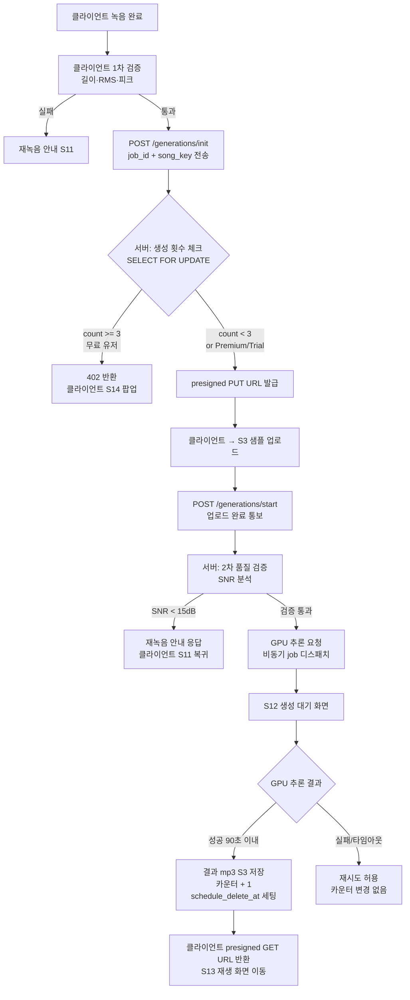

# Voice Pipeline — 자장(Jajang)

**버전**: v1.0  
**작성일**: 2026-04-24

녹음 → 업로드 → 품질 검증 → SVC 추론 → 믹싱 → 반환 전체 파이프라인 설계.
생성 횟수 카운터 enforcement 포함.

---

## 1. 파이프라인 전체 흐름



---

## 2. 클라이언트 1차 품질 검증

S11 "이 목소리로 만들기" 버튼 탭 시 실행. 서버 업로드 전 빠른 피드백 제공.

| 항목 | 기준 | 계산 방법 |
|---|---|---|
| 길이 | 30초 이상 | 녹음 duration (expo-av 메타데이터) |
| 음량(RMS) | -40dB ~ -6dB | 전체 샘플 RMS 계산 |
| 클리핑(피크) | 피크 3회 이하 | 진폭 > 0.95 인 샘플 카운트 |

```typescript
// apps/mobile/src/utils/audio-quality.ts

export interface QualityResult {
  passed: boolean
  reason?: 'too_short' | 'too_quiet' | 'too_loud' | 'clipping'
}

export function validateAudioQuality(
  durationSec: number,
  pcmSamples: Float32Array,  // 정규화된 [-1, 1] PCM 데이터
): QualityResult {
  // 길이 체크
  if (durationSec < 30) return { passed: false, reason: 'too_short' }

  // RMS 계산
  const rms = Math.sqrt(pcmSamples.reduce((sum, s) => sum + s * s, 0) / pcmSamples.length)
  const rmsDb = 20 * Math.log10(rms + 1e-10)
  if (rmsDb < -40) return { passed: false, reason: 'too_quiet' }
  if (rmsDb > -6) return { passed: false, reason: 'too_loud' }

  // 클리핑 피크 카운트
  const peakCount = pcmSamples.filter(s => Math.abs(s) > 0.95).length
  if (peakCount > 3) return { passed: false, reason: 'clipping' }

  return { passed: true }
}
```

**실패 메시지 매핑:**

| reason | UI 메시지 | 화면 |
|---|---|---|
| `too_short` | "30초 이상 녹음이 필요해요" | S11 에러 + 재녹음 버튼 |
| `too_quiet` | "조금 더 크게 녹음해주세요" | S11 에러 + 재녹음 버튼 |
| `too_loud` | "마이크에 너무 가까이 계셨어요 — 조금 멀리서 다시 해봐요" | S11 에러 + 재녹음 버튼 |
| `clipping` | "마이크에 너무 가까이 계셨어요 — 조금 멀리서 다시 해봐요" | S11 에러 + 재녹음 버튼 |

---

## 3. 생성 횟수 카운터 Enforcement

### API 엔드포인트 설계

```
POST /generations/init
  Request:  { job_id: UUID, song_key: string }
  Response 200: { upload_url: string, s3_key: string }
  Response 402: { error: "generation_limit_exceeded", count: 3, limit: 3 }

POST /generations/start
  Request:  { job_id: UUID }
  Response 200: { status: "processing", estimated_seconds: 60 }
  Response 404: { error: "job_not_found" }

GET /generations/{job_id}/status
  Response 200: { status: "pending|processing|completed|failed", track_url?: string }
```

### 서버 로직 (생성 횟수 체크)

```python
# apps/api/routers/generations.py

@router.post("/generations/init")
async def init_generation(
    body: InitGenerationRequest,
    current_user: User = Depends(get_current_user),
    db: AsyncSession = Depends(get_db),
):
    # Premium/Trial은 횟수 체크 스킵
    entitlement = await get_entitlement(db, current_user.id)
    if entitlement in ('trial', 'premium'):
        return await _issue_upload_url(db, current_user.id, body)

    # 무료 유저: SELECT FOR UPDATE
    async with db.begin():
        counter = await db.execute(
            select(GenerationCounter)
            .where(GenerationCounter.user_id == current_user.id)
            .with_for_update()
        )
        counter = counter.scalar_one_or_none()
        
        if counter is None:
            # 신규 유저 — 카운터 생성
            counter = GenerationCounter(user_id=current_user.id, count=0)
            db.add(counter)
            await db.flush()
        
        if counter.count >= 3:
            raise HTTPException(
                status_code=402,
                detail={"error": "generation_limit_exceeded", "count": counter.count, "limit": 3}
            )
        
        # 업로드 URL 발급 (아직 카운터 증가 없음)
        return await _issue_upload_url(db, current_user.id, body)
```

### 카운터 증가 (GPU 추론 성공 후)

```python
# apps/api/services/voice_pipeline.py

async def on_generation_success(db: AsyncSession, user_id: UUID, job_id: UUID):
    """GPU 추론 성공 콜백 시 호출"""
    async with db.begin():
        # 멱등성 체크: 이미 completed 상태면 카운터 증가 스킵
        track = await db.get(GeneratedTrack, job_id)
        if track.status == 'completed':
            return  # 이미 처리됨
        
        # 트랙 상태 업데이트
        track.status = 'completed'
        track.completed_at = datetime.utcnow()
        
        # 카운터 증가 (무료 유저만)
        entitlement = await get_entitlement(db, user_id)
        if entitlement == 'free':
            await db.execute(
                update(GenerationCounter)
                .where(GenerationCounter.user_id == user_id)
                .values(
                    count=GenerationCounter.count + 1,
                    last_generated_at=datetime.utcnow(),
                    updated_at=datetime.utcnow(),
                )
            )
        
        # 샘플 24h 삭제 예약
        await db.execute(
            update(VoiceSample)
            .where(VoiceSample.id == track.voice_sample_id)
            .values(schedule_delete_at=datetime.utcnow() + timedelta(hours=24))
        )
```

### Race Condition 시나리오 대응

| 시나리오 | 대응 |
|---|---|
| 동시에 두 개 업로드 요청 | SELECT FOR UPDATE로 첫 번째 트랜잭션이 lock → 두 번째는 대기 → 첫 번째 완료 후 count 재확인 |
| 클라이언트 재시도 (동일 job_id) | `generated_tracks.job_id` UNIQUE constraint → INSERT 실패 → 기존 레코드 상태 반환 |
| 서버 재시작 중 생성 완료 콜백 | GPU 서비스 → webhook 방식 콜백 → 재시도 가능한 idempotent 핸들러 |

---

## 4. 서버사이드 2차 품질 검증 (SNR)

```python
# apps/api/services/quality_check.py
import librosa
import numpy as np

async def validate_snr(s3_key: str) -> tuple[bool, float]:
    """S3에서 샘플 다운로드 후 SNR 계산"""
    audio_bytes = await download_from_s3(s3_key)
    y, sr = librosa.load(io.BytesIO(audio_bytes), sr=None)
    
    # 간단 SNR 추정: 신호 대 잡음비
    # RMS 기반 추정 (음성 구간 vs 배경 구간)
    frame_length = int(0.025 * sr)
    hop_length = int(0.010 * sr)
    rms = librosa.feature.rms(y=y, frame_length=frame_length, hop_length=hop_length)[0]
    
    # 상위 75%: 신호, 하위 25%: 잡음으로 추정
    signal_rms = np.percentile(rms, 75)
    noise_rms = np.percentile(rms, 25)
    snr_db = 20 * np.log10((signal_rms + 1e-10) / (noise_rms + 1e-10))
    
    return snr_db >= 15.0, snr_db
```

---

## 5. GPU 추론 연동 (추상화 레이어)

```python
# apps/api/services/voice_pipeline.py

async def dispatch_generation(
    job_id: UUID,
    sample_s3_key: str,
    melody_s3_key: str,
    song_key: str,
) -> None:
    """
    GPU 추론 비동기 디스패치.
    M0 선정 모델에 따라 구체 구현 교체.
    """
    client = get_inference_client()  # ENV/MOCK_GPU 분기
    
    # DB에 processing 상태 기록
    await update_track_status(job_id, 'processing')
    
    # 비동기 추론 시작 (Celery task 또는 GPU API 비동기 호출)
    celery_app.send_task(
        'tasks.run_inference',
        args=[str(job_id), sample_s3_key, melody_s3_key, song_key],
        time_limit=90,  # 90초 타임아웃
    )
```

### Celery Task

```python
# apps/api/tasks/generation.py

@celery_app.task(bind=True, max_retries=0)
def run_inference(self, job_id: str, sample_key: str, melody_key: str, song_key: str):
    try:
        client = get_inference_client()
        result_key = asyncio.run(client.run(sample_key, melody_key, song_key))
        asyncio.run(on_generation_success(db_session(), UUID(job_id), result_key))
    except Exception as e:
        asyncio.run(on_generation_failure(db_session(), UUID(job_id), str(e)))
        # 재시도 없음 — 클라이언트가 동일 job_id로 재시도
```

---

## 6. 목소리 샘플 24h 삭제 스케줄러

### Celery Beat 설정

```python
# apps/api/core/celery_config.py

beat_schedule = {
    'cleanup-voice-samples': {
        'task': 'tasks.cleanup_voice_samples',
        'schedule': crontab(minute=0),  # 매 시각 정각 실행
    },
}
```

### 삭제 Task

```python
# apps/api/tasks/cleanup.py

@celery_app.task
def cleanup_voice_samples():
    """
    schedule_delete_at <= NOW() 인 샘플 S3 삭제 후 DB deleted_at 세팅.
    S3 lifecycle (2일 만료)이 백업으로 동작.
    """
    async def _run():
        async with get_db_session() as db:
            # 삭제 대상 조회
            result = await db.execute(
                select(VoiceSample)
                .where(
                    VoiceSample.deleted_at.is_(None),
                    VoiceSample.schedule_delete_at <= datetime.utcnow(),
                )
                .limit(100)  # 배치 처리
            )
            samples = result.scalars().all()
            
            for sample in samples:
                try:
                    await delete_from_s3(sample.s3_key)
                    sample.deleted_at = datetime.utcnow()
                    sample.status = 'deleted'
                except Exception as e:
                    logger.error(f"S3 삭제 실패: {sample.id}, {e}")
                    # 실패 시 다음 주기에 재시도 (schedule_delete_at 유지)
            
            await db.commit()
            logger.info(f"Voice sample cleanup: {len(samples)} processed")
    
    asyncio.run(_run())
```

### 삭제 감사 로그

삭제 완료 시 `structlog`로 기록:
```python
logger.info("voice_sample_deleted",
    user_id=str(sample.user_id),
    sample_id=str(sample.id),
    created_at=sample.created_at.isoformat(),
    schedule_delete_at=sample.schedule_delete_at.isoformat(),
    actual_deleted_at=datetime.utcnow().isoformat(),
)
```

---

## 7. PD 자장가 멜로디 소스 정책

| 곡 | 소스 | 형식 | 라이선스 |
|---|---|---|---|
| 브람스 자장가 | IMSLP 또는 직접 MIDI 생성 | MIDI / WAV | CC0 또는 직접 생성 |
| 모차르트 자장가 | IMSLP 또는 직접 MIDI 생성 | MIDI / WAV | CC0 또는 직접 생성 |
| 슈베르트 자장가 | IMSLP 또는 직접 MIDI 생성 | MIDI / WAV | CC0 또는 직접 생성 |
| Twinkle Twinkle | 직접 MIDI 생성 (단순 선율) | MIDI | 직접 생성 |
| Rock-a-bye Baby | 직접 MIDI 생성 | MIDI | 직접 생성 |
| Hush Little Baby | 직접 MIDI 생성 | MIDI | 직접 생성 |

**금지**: 기존 상업 녹음본(음반) 참조 멜로디 사용. PD 악곡이라도 특정 녹음본에 저작인접권 잔존 가능.  
**검증 체크리스트**: 각 소스 URL + 라이선스 원문 링크 → `docs/reference.md` §멜로디 소스 섹션에 기록.

### S3 멜로디 소스 저장 위치

```
jajang-audio/
└── melodies/
    ├── brahms_lullaby.mid
    ├── mozart_lullaby.mid
    ├── schubert_lullaby.mid
    ├── twinkle.mid
    ├── rockabye.mid
    └── hush.mid
```

GPU 추론 시 `melody_s3_key = f"melodies/{song_key}.mid"` 형태로 전달.

---

## 8. Challenge-Response 라이브 녹음 강제

S09 가이드 화면에 랜덤 문구 표시로 제3자 녹음 업로드 차단.

```python
# apps/api/services/challenge.py

CHALLENGE_PHRASES = [
    "달빛 아래 우리 아기 잠들어요",
    "자장 자장 우리 아기",
    "별빛 가득한 밤이에요",
    "엄마 아빠 목소리 들어봐요",
    "조용히 눈을 감아요",
]

def get_random_challenge() -> str:
    return random.choice(CHALLENGE_PHRASES)
```

클라이언트에서 `GET /challenges/random` 요청 → 문구 반환 → S09 화면 표시.
서버는 이 문구 자체를 녹음 내용과 대조하지 않음 (음성 텍스트 인식 비용 불필요). 화면 표시 + UX 마찰만으로 제3자 업로드 대부분 차단.

> 주의: 완벽한 기술적 차단은 불가. TOS 위반 명시 + 법적 책임 고지로 보완.
